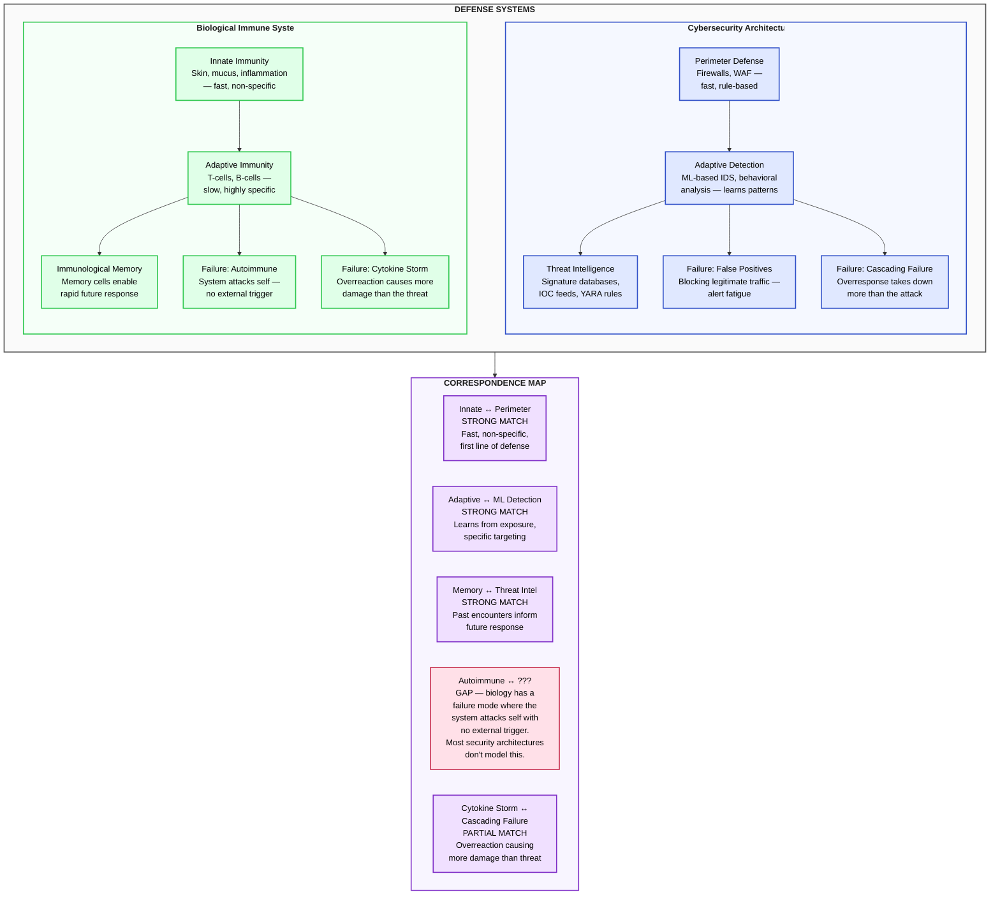
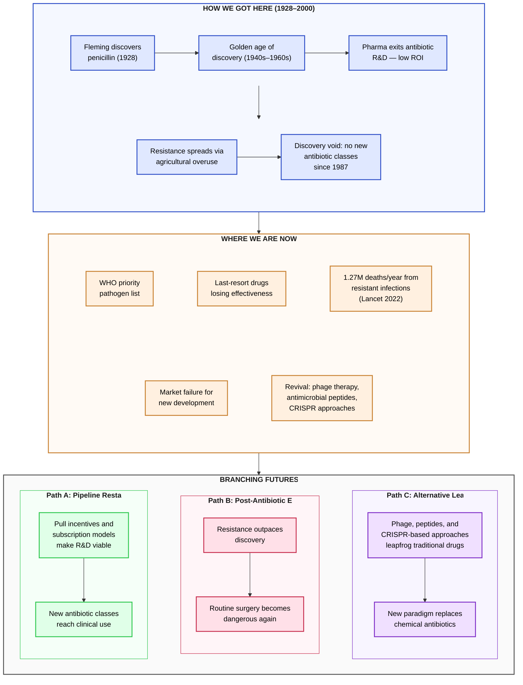
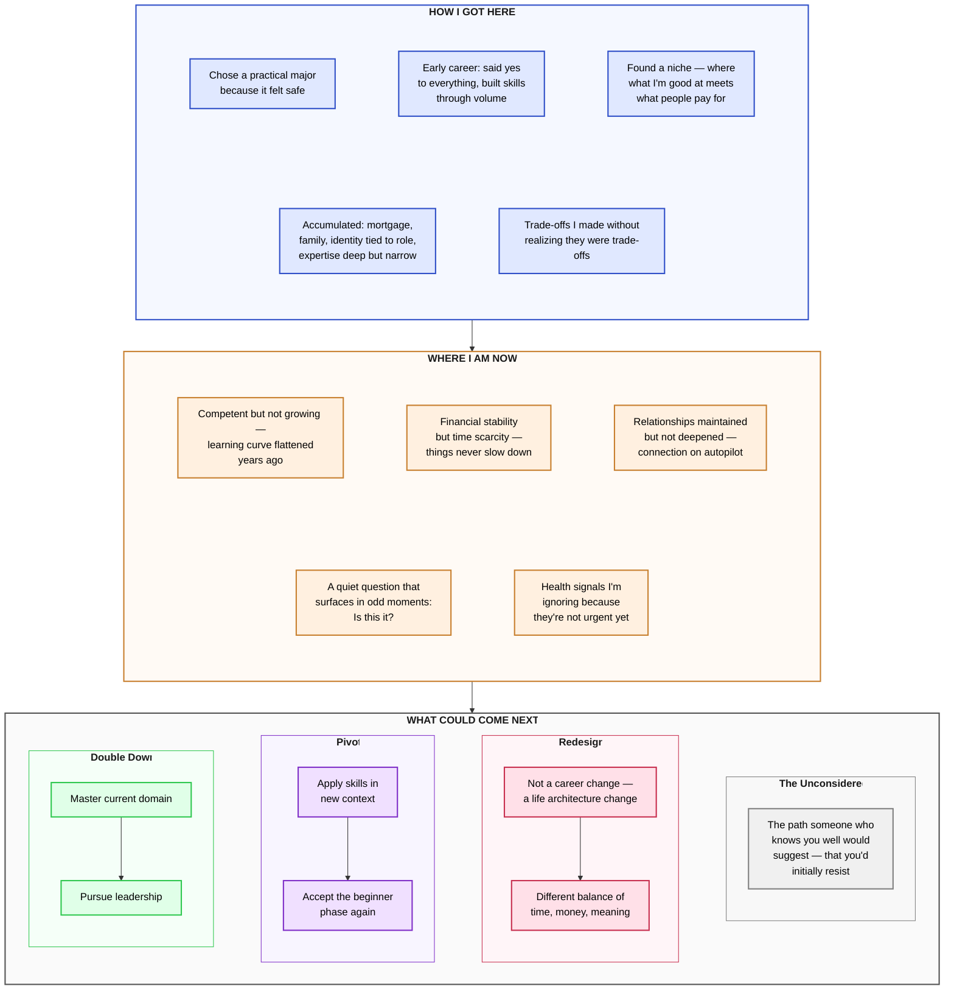
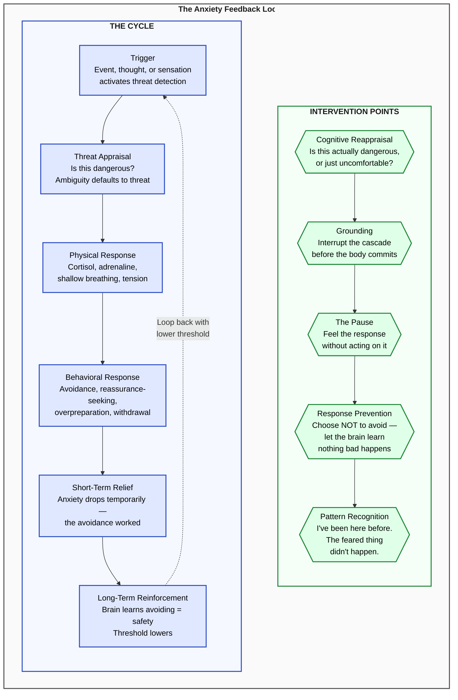
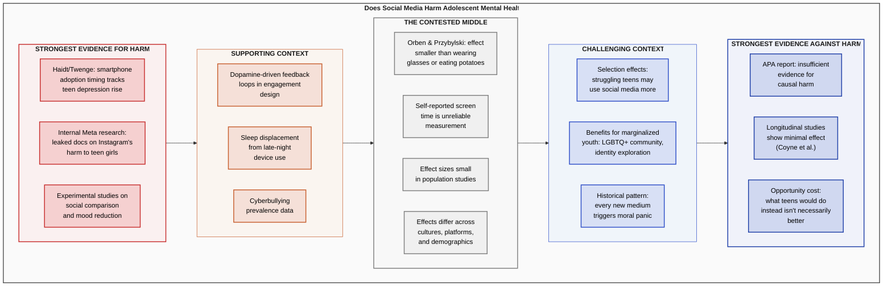
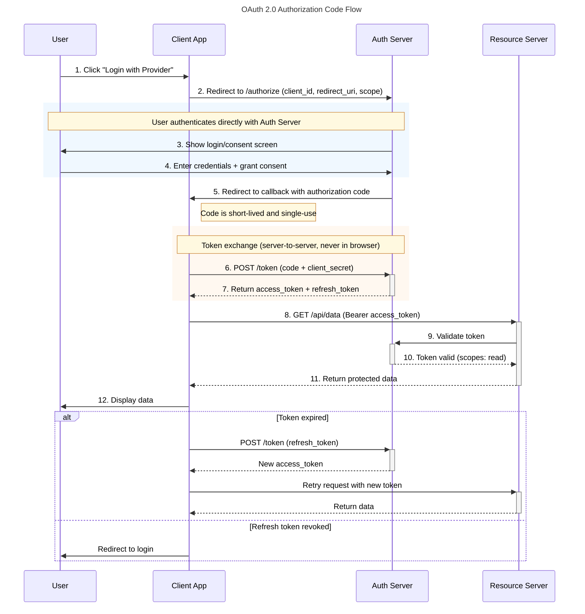

# MDG Examples Gallery

Diagrams don't just illustrate information — they help you *think*.

Everything below was generated by an LLM using MDG v1.0. Each example demonstrates a different way of seeing a topic — from personal decisions to scientific debates to system architectures.

**The most important thing about these examples:** You can replace any topic with something from your own life. "Create an Evidence Spectrum for whether I should leave my job" works just as well as the examples below. The structure is the tool. The topic is yours.

- [Prompt Templates](PROMPT-TEMPLATES.md) — reusable prompts for all of these patterns
- [SKILL.md](SKILL.md) — drop this into your Claude Project and start

---

## Contents

- [Cognitive Science](#cognitive-science)
- [Cross-Domain Bridges](#cross-domain-bridges)
- [Life Sciences & Medicine](#life-sciences--medicine)
- [Personal Decision-Making](#personal-decision-making)
- [Psychology & Self-Understanding](#psychology--self-understanding)
- [Social Sciences](#social-sciences)
- [Technology & Engineering](#technology--engineering)

---

## Cognitive Science

### Flynn's Three Pillars of Modern Intelligence

Three cognitive gains that drove a century of rising IQ — classification, abstraction, hypothetical reasoning — are exactly what well-structured diagrams operationalize.

**Template:** The Depth Ladder (Working Model) | **MDG Techniques:** T5 Grid Layout, T1 Transparent Wrapper, T4 Aspect Ratio, full palette

```mermaid
%%mdg:DGM:1.0%%
%%{init: {'theme': 'default', 'themeVariables': { 'fontSize': '18px' }}}%%

flowchart TB
    subgraph Title["Flynn's Three Pillars of Modern Intelligence"]

        subgraph y[" "]
            direction TB
            Flynn["James Flynn<br>The Flynn Effect"]
            Insight["IQ scores rose ~3 points per decade<br>across the 20th century"]
            Flynn ~~~ Insight
        end

        subgraph Pillars["THE THREE COGNITIVE GAINS"]
            direction LR
            subgraph PillarOne["1 · Classification"]
                direction TB
                P1Def["Organizing the world<br>into abstract categories"]
                P1Diag["Diagrams: Shape & color<br>encoding creates<br>visual categories"]
                P1Def --> P1Diag
            end
            subgraph PillarTwo["2 · Abstraction"]
                direction TB
                P2Def["Reasoning with abstract<br>concepts & making them<br>logically consistent"]
                P2Diag["Diagrams: Hierarchical<br>nesting makes abstract<br>relationships navigable"]
                P2Def --> P2Diag
            end
            subgraph PillarThree["3 · Hypothetical Reasoning"]
                direction TB
                P3Def["Engaging seriously<br>with things not<br>physically present"]
                P3Diag["Diagrams: Invisible<br>structures become visible —<br>gaps, dependencies,<br>consequences revealed"]
                P3Def --> P3Diag
            end
            PillarOne ~~~ PillarTwo ~~~ PillarThree
        end

        subgraph Synthesis["SYNTHESIS"]
            direction LR
            Amp(("A well-structured<br>diagram is a<br>cognitive amplifier"))
            MDG["MDG ensures LLM-generated<br>diagrams actually<br>function as one"]
            Amp --> MDG
        end

        Insight --> Pillars
        Pillars --> Synthesis
    end

classDef flynnNode fill:#E0E8FF,stroke:#3050C8,stroke-width:2px,color:#000000
classDef pillarDef fill:#FFF0E0,stroke:#C88030,stroke-width:2px,color:#000000
classDef pillarDiag fill:#E0FFE8,stroke:#30C850,stroke-width:2px,color:#000000
classDef synthNode fill:#F0E0FF,stroke:#8030C8,stroke-width:2px,color:#000000
classDef ampNode fill:#FFE0E8,stroke:#C83050,stroke-width:2px,color:#000000

class Flynn,Insight flynnNode
class P1Def,P2Def,P3Def pillarDef
class P1Diag,P2Diag,P3Diag pillarDiag
class MDG synthNode
class Amp ampNode

style Title fill:#F5F8FF,stroke:#3050C8,stroke-width:3px,color:#1a1a1a,font-weight:bold
style y fill:transparent,stroke:transparent,stroke-width:0px
style Pillars fill:#FFFAF5,stroke:#C88030,stroke-width:2px,color:#1a1a1a,font-weight:bold
style PillarOne fill:#FFF8F0,stroke:#C88030,stroke-width:1px,color:#1a1a1a,font-weight:bold
style PillarTwo fill:#FFF8F0,stroke:#C88030,stroke-width:1px,color:#1a1a1a,font-weight:bold
style PillarThree fill:#FFF8F0,stroke:#C88030,stroke-width:1px,color:#1a1a1a,font-weight:bold
style Synthesis fill:#F8F5FF,stroke:#8030C8,stroke-width:2px,color:#1a1a1a,font-weight:bold
```

> *See the raw source: [`examples/flynn-three-pillars.mermaid`](examples/flynn-three-pillars.mermaid)*

**What this reveals:** Three cognitive gains that drove a century of rising IQ — classification, abstraction, hypothetical reasoning — are exactly what well-structured diagrams operationalize. A diagram is a cognitive amplifier because it exercises all three pillars simultaneously.

---

## Cross-Domain Bridges

### Immune System ↔ Cybersecurity Architecture

Two defense systems that evolved independently — one biological, one digital — mapped against each other to reveal where the analogy holds, where it breaks, and what the gap means.

**Template:** The Cross-Domain Bridge | **MDG Techniques:** T5 grid (asymmetric), T4 aspect ratio, two color families + third for correspondence

**What this reveals:** The autoimmune gap — where biology has a failure mode that most cybersecurity architectures don't model — is a genuine blind spot worth investigating. When a security system starts blocking legitimate internal traffic with no external trigger, that IS an autoimmune response. Most incident response frameworks don't have a playbook for "the defense system is the threat." The diagram makes this gap impossible to miss.

---

## Life Sciences & Medicine

### The Rise and Future of Antibiotics

From Fleming's discovery through the golden age to the current crisis — and three possible futures that depend on decisions being made now.

**Template:** The Temporal Triptych | **MDG Techniques:** T3 stacked pipeline, T2 branching for futures, color shift across time

**What this reveals:** The "discovery void" — no new antibiotic classes since 1987 — is visually stark against the golden age that preceded it. The branching futures show this is a decision point, not a trajectory. The 1.27 million deaths figure anchors the urgency in data rather than rhetoric.

---

## Personal Decision-Making

### Your Life in Three Timeframes

A mid-career professional taking stock — past, present, and branching futures.

**Template:** The Temporal Triptych | **MDG Techniques:** T3 stacked pipeline, T2 branching for futures, subgraph-to-subgraph connections

**What this reveals:** The three timeframes make visible something we rarely see about our own lives: the past was shaped by decisions that felt small at the time, the present is a system not a snapshot, and the future isn't a single track. The fourth path — "the one you'd initially resist" — is often the most interesting node.

> **Make it yours:** Ask your LLM: "Create a Temporal Triptych for my life. Here's what I'd put in each section: [your notes]." The diagram will show you patterns across time that are hard to see when you're living inside them.

---

## Psychology & Self-Understanding

### Burnout Is a System, Not a Feeling

Burnout modeled as a self-reinforcing system with five subsystems and the feedback loops that keep it spinning.

**Template:** The Eight Views (System Architecture lens) | **MDG Techniques:** T6 hub-and-spoke, dotted bidirectional arrows for feedback loops, T4 aspect ratio on spokes

```mermaid
%%mdg:DGM:1.0%%
%%{init: {'theme': 'default', 'themeVariables': { 'fontSize': '16px' }}}%%

flowchart TB
    Hub(("THE BURNOUT CYCLE<br>A self-reinforcing system"))

    subgraph Demand["1. Demand Overload"]
        direction TB
        D1["Work volume exceeds<br>sustainable capacity"]
        D2["Urgent displaces important<br>every single day"]
        D3["Each interruption costs<br>~23 min of refocus"]
        D1 --> D2 --> D3
    end

    subgraph Recovery["2. Recovery Deficit"]
        direction TB
        R1["Sleep debt accumulates<br>below awareness threshold"]
        R2["Exercise, social time,<br>creative time — first cut"]
        R3["Rest becomes passive<br>screen time: numbs<br>but doesn't restore"]
        R1 --> R2 --> R3
    end

    subgraph Identity["3. Identity Fusion"]
        direction TB
        I1["Self-worth couples<br>to productivity"]
        I2["Saying no feels like<br>failing — boundaries<br>feel like weakness"]
        I3["I'm fine becomes the<br>automatic response that<br>blocks early intervention"]
        I1 --> I2 --> I3
    end

    subgraph Silence["4. Organizational Silence"]
        direction TB
        O1["Systems reward visible<br>effort, not sustainable output"]
        O2["Asking for help reads<br>as underperformance"]
        O3["The people who burn out<br>are the ones the org<br>relies on most"]
        O1 --> O2 --> O3
    end

    subgraph Narrowing["5. The Narrowing"]
        direction TB
        N1["Interests, relationships,<br>curiosity contract"]
        N2["Feels like focus —<br>is actually depletion"]
        N3["Loss of perspective makes<br>every setback existential"]
        N1 --> N2 --> N3
    end

    Hub --> Demand
    Hub --> Recovery
    Hub --> Identity
    Hub --> Silence
    Hub --> Narrowing

    Demand <-.-> Recovery
    Recovery <-.-> Identity
    Identity <-.-> Silence
    Silence <-.-> Demand
    Narrowing <-.-> Demand
    Narrowing <-.-> Identity

classDef hubNode fill:#FFE0E8,stroke:#C83050,stroke-width:3px,color:#000000
classDef demandNode fill:#FFF0E0,stroke:#C88030,stroke-width:2px,color:#000000
classDef recoveryNode fill:#E0E8FF,stroke:#3050C8,stroke-width:2px,color:#000000
classDef identityNode fill:#F0E0FF,stroke:#8030C8,stroke-width:2px,color:#000000
classDef silenceNode fill:#E0FFE8,stroke:#30C850,stroke-width:2px,color:#000000
classDef narrowNode fill:#F0F0F0,stroke:#808080,stroke-width:2px,color:#000000

class Hub hubNode
class D1,D2,D3 demandNode
class R1,R2,R3 recoveryNode
class I1,I2,I3 identityNode
class O1,O2,O3 silenceNode
class N1,N2,N3 narrowNode

style Demand fill:#FFFAF5,stroke:#C88030,stroke-width:2px,color:#1a1a1a,font-weight:bold
style Recovery fill:#F5F8FF,stroke:#3050C8,stroke-width:2px,color:#1a1a1a,font-weight:bold
style Identity fill:#F8F5FF,stroke:#8030C8,stroke-width:2px,color:#1a1a1a,font-weight:bold
style Silence fill:#F5FFF8,stroke:#30C850,stroke-width:2px,color:#1a1a1a,font-weight:bold
style Narrowing fill:#F8F8F8,stroke:#808080,stroke-width:2px,color:#1a1a1a,font-weight:bold
```

**What this reveals:** The feedback loops become obvious — and so do the intervention points. Breaking ANY single loop weakens the entire cycle. The highest-leverage intervention is usually Subsystem 3 (Identity Fusion) — decoupling self-worth from productivity — because it connects the most loops. Most burnout advice focuses on Subsystems 1 or 2, which is why it doesn't stick.

> **Make it yours:** Ask your LLM: "Create a burnout system diagram for my specific situation. Here's what I'm experiencing: [describe your symptoms]." The diagram will show you YOUR loops and where YOUR highest-leverage intervention might be.

---

### What You Defend vs. What You Need

The gap between the story we tell and what's actually happening underneath — five layers from public performance to private need.

**Template:** The Evidence Spectrum (applied inward) | **MDG Techniques:** T3 stacked pipeline, contrasting color families, cross-grain direction

```mermaid
%%mdg:DGM:1.0%%
%%{init: {'theme': 'default', 'themeVariables': { 'fontSize': '16px' }}}%%

flowchart TB
    subgraph Main["What You Defend vs. What You Need"]
        subgraph Public["THE PUBLIC STORY"]
            direction LR
            PU1["I'm fine —<br>just busy"]
            PU2["I chose this —<br>it's what I want"]
            PU3["I don't need help —<br>I've handled worse"]
        end

        subgraph Private["THE PRIVATE JUSTIFICATION"]
            direction LR
            PR1["This is temporary —<br>things will calm down<br>after the next milestone"]
            PR2["Other people have<br>it harder — I have<br>no right to complain"]
            PR3["If I just push through<br>this phase, it'll<br>get better"]
        end

        subgraph Contested["WHERE HONESTY LIVES"]
            direction LR
            C1["Some of the public<br>story IS true — you are<br>competent, you have<br>handled hard things"]
            C2["Some of the justification<br>IS true — it might<br>be temporary"]
            C3["The question: are these<br>truths preventing you<br>from seeing what's<br>also true?"]
        end

        subgraph Protecting["WHAT YOU'RE PROTECTING"]
            direction LR
            PT1["Admitting it isn't working<br>means admitting past<br>choices led here"]
            PT2["Asking for help means<br>being seen as someone<br>who needs it"]
            PT3["Slowing down means<br>confronting what the<br>busyness was covering"]
        end

        subgraph Need["WHAT YOU ACTUALLY NEED"]
            direction LR
            N1["Permission — from<br>yourself — to not be<br>okay for a while"]
            N2["One honest conversation<br>with someone who won't<br>try to fix it"]
            N3["A small change,<br>not a revolution —<br>the first crack<br>in the pattern"]
        end

        Public --> Private
        Private --> Contested
        Contested --> Protecting
        Protecting --> Need
    end

classDef publicNode fill:#E0E8FF,stroke:#3050C8,stroke-width:2px,color:#000000
classDef privateNode fill:#E0E0F5,stroke:#5050A8,stroke-width:2px,color:#000000
classDef contestedNode fill:#F0F0F0,stroke:#808080,stroke-width:2px,color:#000000
classDef protectNode fill:#F5E0E0,stroke:#A85050,stroke-width:2px,color:#000000
classDef needNode fill:#FFE0E8,stroke:#C83050,stroke-width:2px,color:#000000

class PU1,PU2,PU3 publicNode
class PR1,PR2,PR3 privateNode
class C1,C2,C3 contestedNode
class PT1,PT2,PT3 protectNode
class N1,N2,N3 needNode

style Main fill:#FAFAFA,stroke:#555555,stroke-width:2px,color:#1a1a1a,font-weight:bold
style Public fill:#F5F8FF,stroke:#3050C8,stroke-width:2px,color:#1a1a1a,font-weight:bold
style Private fill:#F5F5FA,stroke:#5050A8,stroke-width:1px,color:#1a1a1a,font-weight:bold
style Contested fill:#F8F8F8,stroke:#808080,stroke-width:2px,color:#1a1a1a,font-weight:bold
style Protecting fill:#FAF5F5,stroke:#A85050,stroke-width:1px,color:#1a1a1a,font-weight:bold
style Need fill:#FFF5F8,stroke:#C83050,stroke-width:2px,color:#1a1a1a,font-weight:bold
```

**What this reveals:** The five layers make visible something therapy takes weeks to surface: the distance between what we perform, what we believe, and what we need. Most people live in layers 1-2. The diagram's value is making layer 5 visible and specific — not as an accusation but as an invitation.

> **Make it yours:** This is the most personal template. Ask your LLM: "Create a 'What I Defend vs. What I Need' diagram about [a specific situation]." You might be surprised what shows up in layer 5. You might also find that seeing it laid out makes it less frightening than keeping it unexamined.

---

### The Anxiety Feedback Loop

How anxiety self-reinforces — and the specific points where the cycle can be interrupted.

**Template:** The Eight Views (Process Flow lens) | **MDG Techniques:** Flowchart with cycle, hexagon nodes for intervention points, contrasting intervention color

**What this reveals:** Two things that text descriptions miss. First, avoidance IS the problem — it provides relief that trains the brain to be more anxious next time. Second, the intervention points are specific and actionable — you don't have to fix "anxiety," you just have to interrupt the cycle at one point.

> **Make it yours:** Ask your LLM: "Create an anxiety feedback loop for my specific pattern. My typical trigger is [X], my usual avoidance is [Y], and the thing I'm actually afraid of is [Z]." Seeing YOUR cycle — not a generic one — makes the intervention points real.

---

## Social Sciences

### Does Social Media Harm Adolescent Mental Health?

The most contested question in tech policy, laid out from strongest evidence for harm to strongest evidence against — forcing you to sit with the full spectrum instead of cherry-picking a side.

**Template:** The Evidence Spectrum | **MDG Techniques:** T3 stacked pipeline, warm-to-cool color gradient, cross-grain direction

**What this reveals:** The spectrum makes it impossible to cherry-pick. Strong correlational signals at the top, strong methodological challenges at the bottom, and a genuinely contested middle where the Orben & Przybylski finding — that the measured effect is smaller than wearing glasses — sits uncomfortably next to the leaked Meta research. The diagram doesn't resolve the debate, but it shows you the full shape of it.

---

## Technology & Engineering

### OAuth 2.0 Authorization Code Flow

The security flow that protects most of the web — showing why the authorization code as a short-lived intermediary is the key design insight.

**Template:** Direct documentation | **MDG Techniques:** sequenceDiagram boilerplate, `+`/`-` activation, `alt`/`else`, `rect` highlight

**What this reveals:** The authorization code as a short-lived intermediary that never reaches the browser — that's the security property that makes this flow safe. The `rect` highlights make the two critical exchanges visually distinct: user authentication (which happens at the Auth Server, not the Client) and token exchange (which happens server-to-server, never exposed to the browser). Most OAuth explanations bury this; the sequence diagram makes it structural.

---

## Making It Personal

Every template above works when you replace the topic with something from your own life:

- **"Create an Evidence Spectrum for whether I should [your decision]"**
- **"Create a Temporal Triptych for my [career / relationship / health journey]"**
- **"Map my burnout as a system — here's what I'm experiencing: [your situation]"**
- **"Show me the anxiety feedback loop for my specific pattern: [your trigger, your avoidance, your fear]"**
- **"Create 'What I Defend vs. What I Need' for [your situation]"**

The diagrams don't tell you what to do. They show you the shape of what you're navigating — laid out spatially, with gaps and connections visible. Sometimes seeing the structure is enough to unstick it.

---

## Create Your Own

1. Install [SKILL.md](SKILL.md) in your Claude Project (or paste into any LLM system prompt)
2. Pick a [Prompt Template](PROMPT-TEMPLATES.md)
3. Replace `[TOPIC]` with whatever you're trying to understand

The skill handles layout, styling, and accessibility. You bring the question.
