# Mermaid Diagram Guidelines (MDG)

**A skill file that makes LLMs dramatically better at generating Mermaid diagrams.**

---

## The Problem

LLMs generate broken, ugly, or unreadable Mermaid diagrams because they:

- Use spaces in subgraph IDs (syntax error)
- Forget `color:#000000` in classDefs (invisible text in dark mode)
- Target leaf nodes across subgraph boundaries (layout explosions)
- Produce flat, unstyled walls of nodes with no visual hierarchy

MDG fixes all of this.

---

<details>
<summary><h2>Why Diagrams Matter: The Three Pillars of Modern Intelligence</h2></summary>

Psychologist James Flynn spent decades studying a remarkable phenomenon: IQ scores across the industrialized world rose steadily throughout the 20th century — roughly 3 points per decade. This wasn't because people were born smarter. The gains were overwhelmingly concentrated in abstract reasoning, not vocabulary or arithmetic.

In his [TED talk](https://www.ted.com/talks/james_flynn_why_our_iq_levels_are_higher_than_our_grandparents) and published research, Flynn identified three cognitive abilities that drove this rise:

1. **Classification** — organizing the world into abstract categories rather than by concrete, practical associations. When asked what a crow and a fish have in common, earlier generations answered practically ("a crow eats a fish"). Modern thinkers default to taxonomic reasoning ("they're both animals").

2. **Using abstractions** — applying formal logical rules to abstract premises and making them internally consistent. Flynn showed that pre-modern subjects often refused to reason from hypothetical premises outside their direct experience, while modern thinkers engage with syllogisms and formal logic readily.

3. **Taking the hypothetical seriously** — willingness to reason about things not physically present, to engage with counterfactuals and theoretical scenarios. This underpins scientific reasoning, moral philosophy, and systems thinking.

Flynn's insight was that modern environments — education, technology, complex workplaces — exercise these cognitive muscles the way nutrition and training build physical strength. The underlying hardware didn't change; the cognitive habits did.

### How diagrams operationalize all three pillars

Diagrams are one of the purest expressions of these three cognitive gains working together:

- **Classification**: Shape and color encoding creates visual categories — rectangles for components, circles for concepts, color families for domains. A well-designed diagram is an act of taxonomic reasoning made visible.

- **Abstraction**: Hierarchical nesting and subgraph containers make abstract relationships concrete and logically navigable. You can see containment, dependency, and flow without holding the entire system in working memory.

- **Hypothetical reasoning**: Diagrams make invisible structures visible — showing gaps, dependencies, and consequences that aren't apparent from text alone. They let you reason about systems that don't physically exist in front of you.

A well-structured diagram is a cognitive amplifier. MDG ensures that LLM-generated diagrams actually function as one.

### Flynn's Three Pillars — MDG Example Diagram

```mermaid
%%mdg:DGM:1.0%%
%%{init: {'theme': 'default', 'themeVariables': { 'fontSize': '18px' }}}%%

flowchart TB
    subgraph Title["Flynn's Three Pillars of Modern Intelligence"]

        subgraph y[" "]
            direction TB
            Flynn["James Flynn<br>The Flynn Effect"]
            Insight["IQ scores rose ~3 points per decade<br>across the 20th century"]
            Flynn ~~~ Insight
        end

        subgraph Pillars["THE THREE COGNITIVE GAINS"]
            direction LR
            subgraph PillarOne["1 · Classification"]
                direction TB
                P1Def["Organizing the world<br>into abstract categories"]
                P1Diag["Diagrams: Shape & color<br>encoding creates<br>visual categories"]
                P1Def --> P1Diag
            end
            subgraph PillarTwo["2 · Abstraction"]
                direction TB
                P2Def["Reasoning with abstract<br>concepts & making them<br>logically consistent"]
                P2Diag["Diagrams: Hierarchical<br>nesting makes abstract<br>relationships navigable"]
                P2Def --> P2Diag
            end
            subgraph PillarThree["3 · Hypothetical Reasoning"]
                direction TB
                P3Def["Engaging seriously<br>with things not<br>physically present"]
                P3Diag["Diagrams: Invisible<br>structures become visible —<br>gaps, dependencies,<br>consequences revealed"]
                P3Def --> P3Diag
            end
            PillarOne ~~~ PillarTwo ~~~ PillarThree
        end

        subgraph Synthesis["SYNTHESIS"]
            direction LR
            Amp(("A well-structured<br>diagram is a<br>cognitive amplifier"))
            MDG["MDG ensures LLM-generated<br>diagrams actually<br>function as one"]
            Amp --> MDG
        end

        Insight --> Pillars
        Pillars --> Synthesis
    end

classDef flynnNode fill:#E0E8FF,stroke:#3050C8,stroke-width:2px,color:#000000
classDef pillarDef fill:#FFF0E0,stroke:#C88030,stroke-width:2px,color:#000000
classDef pillarDiag fill:#E0FFE8,stroke:#30C850,stroke-width:2px,color:#000000
classDef synthNode fill:#F0E0FF,stroke:#8030C8,stroke-width:2px,color:#000000
classDef ampNode fill:#FFE0E8,stroke:#C83050,stroke-width:2px,color:#000000

class Flynn,Insight flynnNode
class P1Def,P2Def,P3Def pillarDef
class P1Diag,P2Diag,P3Diag pillarDiag
class MDG synthNode
class Amp ampNode

style Title fill:#F5F8FF,stroke:#3050C8,stroke-width:3px,color:#1a1a1a,font-weight:bold
style y fill:transparent,stroke:transparent,stroke-width:0px
style Pillars fill:#FFFAF5,stroke:#C88030,stroke-width:2px,color:#1a1a1a,font-weight:bold
style PillarOne fill:#FFF8F0,stroke:#C88030,stroke-width:1px,color:#1a1a1a,font-weight:bold
style PillarTwo fill:#FFF8F0,stroke:#C88030,stroke-width:1px,color:#1a1a1a,font-weight:bold
style PillarThree fill:#FFF8F0,stroke:#C88030,stroke-width:1px,color:#1a1a1a,font-weight:bold
style Synthesis fill:#F8F5FF,stroke:#8030C8,stroke-width:2px,color:#1a1a1a,font-weight:bold
```



> *See the raw source: [`examples/flynn-three-pillars.mermaid`](examples/flynn-three-pillars.mermaid)*

</details>

---

## What's in the Box

```
SKILL.md → Everything: emergency rules, layout techniques,
           8 diagram types, color palettes, RAG mode,
           troubleshooting, and pre-publish checklist
```

One file. Drop it into your Claude Project (or any LLM's system prompt) and go. No folder structure, no dependencies, no routing logic.

---

## Quick Start

1. **Download** `SKILL.md` from this repo
2. **Add** it to your Claude Project as a skill file (upload the single file)
3. **Ask Claude** to generate a Mermaid diagram — it will automatically follow MDG conventions

Also works by pasting `SKILL.md` into any LLM's system prompt or project instructions. Optimized for Claude but the conventions are LLM-agnostic.

---

## How It Works

- **Emergency Rules**: 10 critical syntax and visibility rules that prevent the most common failures — invisible text, broken subgraph IDs, layout explosions
- **Layout Techniques (T1–T6)**: Proven patterns for arranging subgraphs — side-by-side, stacked, grid, hub-and-spoke — with decision trees for choosing the right one
- **Page-Fit Strategy**: Cross-grain direction rule + subgraph-level connections for reliable, compact layout on any medium
- **Dual Mode**: Diagram Mode (human visual consumption) and RAG Mode (knowledge-graph extraction for semantic pipelines)
- **Pre-Publish Checklist**: Verification steps before delivering any diagram — catches the mistakes that make diagrams ugly or broken

---

## Version History

MDG was developed over nearly a year (v0.38–v1.0), beginning as informal notes about Mermaid rendering quirks and evolving into a comprehensive standard through iterative testing and refinement.

The v1.0 release was validated through 4 rounds of structured multi-LLM peer review with 5 reviewer models (GPT, Gemini, Grok, Claude Sonnet, and Claude Haiku), each reviewing independently and surfacing issues across syntax correctness, layout reliability, documentation clarity, and coverage gaps.

See [CHANGELOG.md](CHANGELOG.md) for the full version history from v0.38d1 through v1.0.

---

## Contributing

Contributions welcome. File issues for bugs or feature requests. PRs welcome for:

- New diagram type coverage
- Additional layout techniques
- Palette extensions
- Renderer compatibility reports (VS Code, GitHub, GitLab, Mermaid Live Editor)

---

## Credits

Created by **Steve Becht-Buss** in collaboration with **Anthropic Claude**.

Review process: Four rounds of structured red-team review by GPT, Gemini, Grok, Claude Sonnet, and Claude Haiku.

---

## License

[MIT](LICENSE)
