# Mermaid Diagram Guidelines (MDG v1.0)

This skill enables creation of MDG-compliant Mermaid diagrams with consistent styling, cognitive optimization, and support for both visual presentation and knowledge-graph extraction.

## Quick Start

### Emergency Rules (Always Apply)
1. Use `<br>` for explicit line breaks inside nodes
2. **CRITICAL for flowchart: Always include `color:#000000` in every classDef** — Without this, text is invisible in dark-mode rendering environments. (Flowchart only — classDiagram does NOT support `classDef`; use `themeVariables` instead.)
3. **CRITICAL for flowchart: Apply styles to INDIVIDUAL NODES, not subgraphs** — Subgraph styling does not propagate to node text. Use `class NodeA,NodeB myStyle` for nodes. Use `style SubgraphID ...` for subgraph containers.
4. **CRITICAL: Subgraph identifiers MUST NOT contain spaces** — use CamelCase or underscores
5. **CRITICAL: Subgraph titles need darker styling** — Use `style` directive to ensure subgraph labels are visible against colored backgrounds
6. **CRITICAL: Every diagram MUST have a title** — Use the appropriate title mechanism for each diagram type (see Title Requirements below)
7. First non-blank line **must** be an MDG header tag (e.g., `%%mdg:DGM:1.0%%`)
8. If metadata unknown, ask user once, then fill in available information
9. **Mobile limitation**: Mermaid artifacts render in artifact panel on desktop but may not work on mobile
10. **CRITICAL for flowchart: Default to targeting subgraphs, not leaf nodes, when crossing container boundaries.** Targeting leaf nodes inside a container that uses `direction` for arrangement (a "directional container") often overrides the container's internal layout. If semantic accuracy requires targeting a specific interior node, do so — but expect possible layout instability and test carefully. (See Principle 3 Critical Warning below)

### Quick Reference: Flowchart Layout Techniques

| Layout Goal | Technique | Key Constraint |
|-------------|-----------|----------------|
| Floating header/title | T1 | `style` wrapper transparent; use `~~~` not `-->` to connect |
| Side-by-side (from common source) | T2 | External node → child **subgraphs** (not leaf nodes) |
| Stacked vertically | T3 | Sequential edges between child subgraphs |
| Side-by-side (aspect ratio) | T4 | `direction TB` on children makes them narrow |
| Grid (N×M) | T5 | `direction LR` rows + `direction TB` children + `~~~` ordering |
| Hub-and-spoke | T6 | Central node at top level; subgraph-level edges to spokes |
| **NEVER** | — | External edges to **leaf nodes** inside directional containers |

### Flowchart Layout Decision Tree

1. **Simple stepwise pipeline** → subgraph-to-subgraph sequential flow (T3)
2. **Peer paths from a common source** → external common-source edges to child subgraphs (T2 + T4)
3. **Peer subgraphs side by side (no common source)** → `direction TB` on children for aspect ratio; combine with `~~~` if ordering matters (T4)
4. **Grid or quadrant (2×2, N×M)** → row containers with `direction LR` + child `direction TB` + `~~~` ordering (T5)
5. **Hub-and-spoke / radial** → central node with subgraph-level edges to spoke containers (T6)
6. **Asymmetric composite** → stacked row containers; each row may have 1, 2, or 3 children (T5 variant)
7. **Would your design require a cross-boundary edge to a leaf node inside a directional container?** → redesign to target the containing subgraph instead, or split diagrams

### Rule Priority (when rules conflict)

1. Syntax validity (character safety, no spaces in IDs)
2. Emergency Rules 1–10
3. Text visibility / accessibility (`color:#000000`, contrast)
4. Layout stability (Principles 1–3)
5. Aesthetic preferences (palettes, legends, shapes)

### Title Requirements

Every diagram must include a title. The mechanism varies by diagram type:

| Diagram Type | Title Mechanism | Example |
|-------------|----------------|---------|
| `flowchart` | Top-level subgraph with title text, or a prominent styled node at top | `subgraph Title["My Diagram Title"]` wrapping all content |
| `sequenceDiagram` | `title` directive | `title API Authentication Flow` |
| `erDiagram` | `title` directive | `title Customer Order Model` |
| `stateDiagram-v2` | `title` directive | `title Order Lifecycle` |
| `classDiagram` | `title` directive | `title Domain Model` |
| `gantt` | `title` directive | `title Project Timeline` |
| `mindmap` | Root node serves as title | Root node text is the title |
| `pie` | `title` directive | `title Budget Allocation` |

For flowcharts, the recommended approach is a top-level container subgraph whose label serves as the diagram title, styled with prominent font weight and color.

### Operating Modes

**Diagram Mode** (default): For human visual consumption
- Prioritize: color palettes, node limits, legends, aesthetics
- Target: presentations, documentation, slides

**RAG Mode**: For knowledge-graph extraction
- Prioritize: one-fact-per-line, stable IDs, semantic structure
- Use header: `%%mdg:RAG:1.0%%`
- Target: semantic web, triples, RAG pipelines

**Detection:**
- Header tag `%%mdg:RAG:*%%` → RAG Mode
- Keywords describing **output type** (not subject matter): "knowledge graph", "triples", "semantic extraction", "ontology" → RAG Mode
- "Draw a flowchart of my RAG pipeline" → Diagram Mode (the word "RAG" describes the subject, not the output)
- **If uncertain** → ask the user: "Should this output be a visual diagram or machine-readable triples?"
- Otherwise → Diagram Mode

## Diagram Type Selection

| Type | When to Use |
|------|-------------|
| `flowchart` | Process flows, system architecture, concept maps |
| `sequenceDiagram` | API calls, message passing, protocol handshakes |
| `erDiagram` | Database schemas, entity relationships, data models |
| `stateDiagram-v2` | State machines, lifecycle models, status workflows |
| `classDiagram` | Class models, entity relationships, UML |
| `gantt` | Timelines, project schedules, milestones |
| `mindmap` | Brainstorming, topic hierarchies, knowledge maps |
| `pie` | Proportional data, budget breakdowns, distributions |

If uncertain about layout technique, default to Technique 3 (stacked pipeline).

---


## Standard Guidelines

| Topic | Guideline |
|-------|-----------|
| Character safety | IDs = `A-Z a-z 0-9 _ -` only |
| Direction | `TB` for docs; `LR` for slides/mobile |
| Legend | Required if > 3 shape types OR > 2 color families |
| Node count | Aim ≤ 60 nodes & ≤ 100 edges for flowcharts (split if needed) |
| Accessibility | Font ≥ 14px mobile / 16px desktop; contrast ≥ 4.5:1 |
| Titles | **Every diagram must have a title** — no exceptions |
| Nesting | Limit subgraph nesting to 2 levels max (see flowchart sections below) |
| Layout engine | Default: dagre (always available). ELK: optional, better for complex diagrams but NOT available in claude.ai artifacts (see ELK section below) |

---

## Pre-Publish Checklist

Before delivering, verify:
- [ ] Header tag present and correct mode
- [ ] Metadata complete
- [ ] **Title present** — every diagram has a title via the appropriate mechanism for its type
- [ ] No spaces in subgraph identifiers
- [ ] Font size initialized
- [ ] **For flowchart**: Every classDef includes `color:#000000`
- [ ] **For flowchart**: Styles applied to individual nodes (via `class`), not subgraphs
- [ ] **For flowchart with subgraphs**: Subgraph titles styled with dark text (`color:#1a1a1a` or `color:#000000`) via `style` directive
- [ ] **For flowchart with subgraphs**: Cross-grain direction — child subgraph `direction` is perpendicular to parent flow (or deliberately overridden with justification)
- [ ] **For flowchart with subgraphs**: Subgraph arrangement — verify against Quick Reference table: pipeline (T2/T3), grid (T5), hub-and-spoke (T6). NO cross-boundary edges targeting leaf nodes inside directional containers (Emergency Rule 10).
- [ ] **For flowchart with subgraphs**: Subgraph-level connections — cross-subgraph arrows target subgraphs, not interior nodes (unless a specific interior node must be identified)
- [ ] **Aspect ratio check**: Resulting diagram fits target medium without scrolling or excessive whitespace
- [ ] **For classDiagram**: Using `theme: 'base'` with proper themeVariables
- [ ] **For classDiagram**: `lineColor` set to light value (e.g., `#AAAAAA`)
- [ ] **For sequenceDiagram**: `title` directive present; participant count ≤ 8; using `+`/`-` activation shorthand
- [ ] **For erDiagram**: All relationships labeled; PK/FK annotated; singular entity names
- [ ] **For stateDiagram-v2**: Start and end states present; all transitions labeled
- [ ] **For gantt**: `title` directive present; dependencies used over hardcoded dates
- [ ] **If using advanced layout**: Invisible container/anchor classes defined
- [ ] **If using advanced layout**: All padding/anchor nodes have `invisible` class applied
- [ ] Legend if > 3 shapes or > 2 color families
- [ ] Node count ≤ 60 (or deliberately exceeded with justification)

---

## Change Log

**Current standard: MDG v1.0**

| Version | Date | Summary |
|---------|------|---------|
| 1.0 | 2026-03-07 | **Public release.** Single-file consolidation. Four rounds of multi-LLM review (GPT, Gemini, Grok, Sonnet, Haiku). No breaking changes from v0.49. |
| 0.49 | 2026-03-07 | **Round 3 micro-fixes:** RAG triple example updated to convention-compliant IDs. Frontmatter description corrected. Technique 6 duplicate sentence removed. Safe Fallback title-wrapper clarification added. |
| 0.48 | 2026-03-07 | Round 2 review (16 changes): troubleshooting section, safe fallback default, routing enforcement, asymmetric composite example, ELK tightening, hub-spoke threshold, Quick Rule. Plus 9 targeted fixes. |
| 0.47 | 2026-03-07 | Structural reorganization. Non-flowchart depth (sequence, ERD, state, Gantt, mindmap, pie, class). ELK layout engine reference. |
| 0.46 | 2026-03-06 | Principle 3 comprehensive rewrite: 5 techniques for subgraph arrangement including Grid Layout. |
| 0.45 | 2026-02-27 | Page-Fit Layout Strategy. New diagram types. |
| 0.44 | 2025-12-04 | Advanced Layout Techniques. Invisible elements toolkit. |
| 0.43 | 2025-11-28 | classDiagram guidance. `color:#000000` rule. |
| 0.40 | 2025-09-02 | Initial structured version. |
| 0.39 | 2025-05-24 | Revision. |
| 0.38d3 | 2025-05-04 | Draft 3. |
| 0.38d2 | 2025-04-27 | Draft 2. |
| 0.38d1 | 2025-04-27 | First draft. |


---

# Diagram Type Reference

## flowchart Diagrams

### flowchart Boilerplate

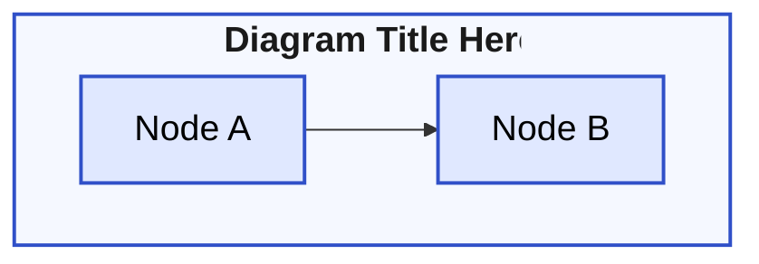

### Critical Syntax Rules

#### Subgraph Declaration (MOST COMMON ERROR)

❌ **INCORRECT** (causes syntax errors):
```mermaid
subgraph Current State["Current State"]
subgraph Data Layer["Data Management"]
```

✅ **CORRECT**:
```mermaid
subgraph CurrentState["Current State"]
subgraph DataLayer["Data Management"]
```

**Rule**: NO SPACES between identifier and brackets. Use CamelCase, underscores, or single words.

#### Node Styling for flowchart (CRITICAL FOR TEXT VISIBILITY)

❌ **INCORRECT** — Applying styles to subgraphs (text inside nodes will be invisible):
```mermaid
subgraph MyGroup["My Group"]
    NodeA[Node A]
    NodeB[Node B]
end
classDef myStyle fill:#E0E8FF,stroke:#3050C8,stroke-width:2px,color:#000000
class MyGroup myStyle
```

✅ **CORRECT** — Apply styles to individual nodes:
```mermaid
subgraph MyGroup["My Group"]
    NodeA[Node A]
    NodeB[Node B]
end
classDef myStyle fill:#E0E8FF,stroke:#3050C8,stroke-width:2px,color:#000000
class NodeA,NodeB myStyle
```

**Rule**: Always apply `class` statements to individual node IDs, not subgraph IDs.

#### Subgraph Title Styling (CRITICAL FOR COLORED DIAGRAMS)

When using colored backgrounds or pastel fills, subgraph titles can become hard to read. Always style subgraph titles with darker, high-contrast colors.

✅ **CORRECT** — Style subgraph titles for visibility:
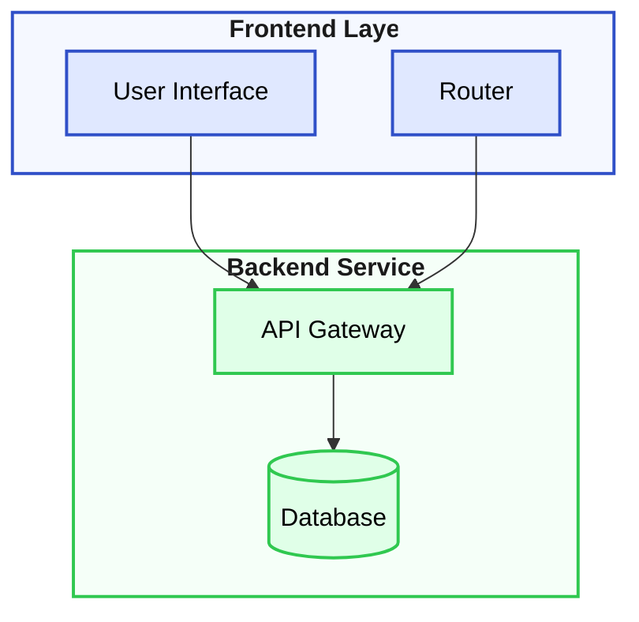

**Subgraph Title Styling Guidelines:**
- Use `style SubgraphID` directive (not `class`) for subgraph containers
- Set `color:#1a1a1a` or `color:#000000` for dark, readable title text
- Add `font-weight:bold` to improve title visibility
- Use lighter fill colors for subgraph backgrounds than for nodes (e.g., `#F5F8FF` instead of `#E0E8FF`)
- Ensure stroke color matches or complements the node color family

---

## Page-Fit Layout Strategy: Direction and Connection Patterns

These two principles control diagram aspect ratio and prevent oversized diagrams. Apply them by default to every flowchart with subgraphs.

### Principle 1: Cross-Grain Direction

**Rule:** When a subgraph is nested inside a parent flow, its internal `direction` should be perpendicular to the parent's flow axis.

| Parent Direction | Child Subgraph Direction | Effect |
|-----------------|-------------------------|--------|
| `flowchart TB` or `flowchart TD` | `direction LR` inside subgraphs | Each step is a horizontal band; steps stack vertically |
| `flowchart LR` | `direction TB` inside subgraphs | Each step is a vertical column; steps flow horizontally |

**Rationale:** If parent and child share the same axis, expansion compounds — a 5-step pipeline with 3 nodes per step produces 15 vertical units of height. Cross-grain direction makes each step expand *across* the flow, not *along* it.

**When to Override (same-grain is acceptable):**
- The subgraph contains a single node (direction is irrelevant)
- The subgraph's content is genuinely sequential along the same axis as the parent (rare)
- You're deliberately creating a tall/narrow or wide/short layout for a specific medium
- Explicit edges between child subgraphs (`==>`) establish rank ordering — in this case, the edges control arrangement, not the parent `direction` (see Combined Example: Multi-Phase Timeline in Advanced Layout)

❌ **Same-grain (tall, won't fit on page):**
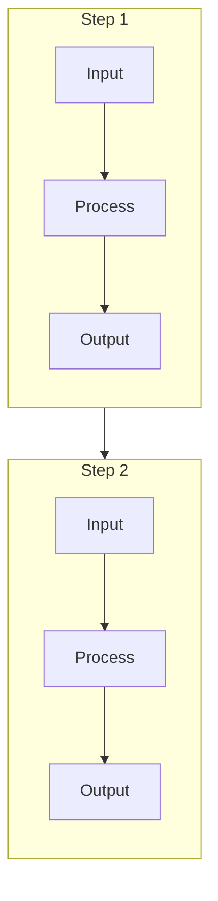

✅ **Cross-grain (compact, fits on page):**
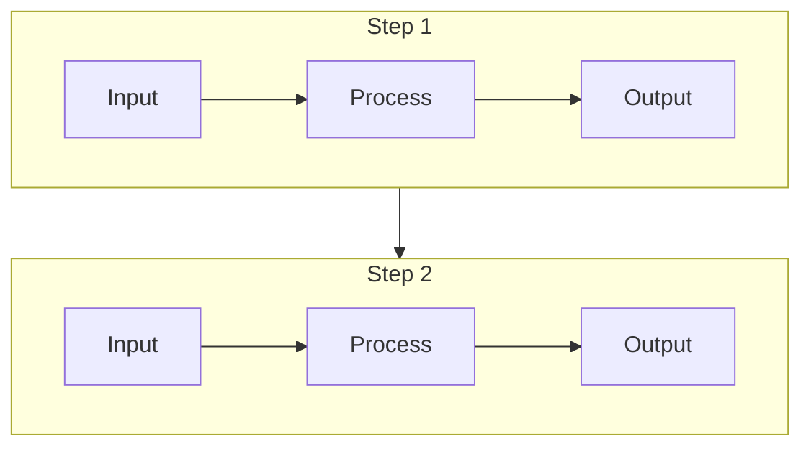

**Nested Subgraphs — alternate direction at each level:**
```
flowchart TB              ← Level 0: vertical
  subgraph Phase1         ← Level 1: horizontal
    direction LR
    subgraph Detail1      ← Level 2: vertical (if needed)
      direction TB
    end
  end
```

Generally avoid more than 2 levels of nesting. If you need 3+, split into multiple diagrams.

### Principle 2: Subgraph-Level Connections

**Rule:** Arrows between subgraphs should connect to the subgraph itself, not to nodes inside the subgraph, unless there is a specific reason to target an interior node.

**Rationale:** When you write `NodeA_Inside_Sub1 --> NodeB_Inside_Sub2`, the layout engine must route an arrow from a specific interior point in Subgraph 1 to a specific interior point in Subgraph 2. This forces spacing expansion, produces long diagonal arrows, and prevents the engine from optimizing compactness.

When you write `Sub1 --> Sub2`, the engine attaches the arrow to the subgraph border at the optimal attachment point. The arrow is short, clean, and the engine retains layout freedom.

**Decision Heuristic:**

| Situation | Connection Level | Example |
|-----------|-----------------|---------|
| Sequential steps in a pipeline | Subgraph → Subgraph | `Step1 --> Step2` |
| Feedback loops between steps | Subgraph → Subgraph | `Step5 --> Step4` |
| Parallel paths from a fork | Node → Subgraph | `FORK --> PathA` |
| Data flow between specific ports | Node → Node (justified) | `API_Output --> DB_Input` |
| Error handling from a specific step | Node → Node (justified) | `Validator --> ErrorHandler` |

**The Test:** Before writing a cross-boundary node-to-node connection, ask: *"Does the reader need to know which specific interior element is the source/target, or just that these two steps are connected?"*
- If they need to know → node-to-node (justified)
- If they just need the flow → subgraph-to-subgraph (default)

❌ **Node-to-node across subgraphs (sprawling):**
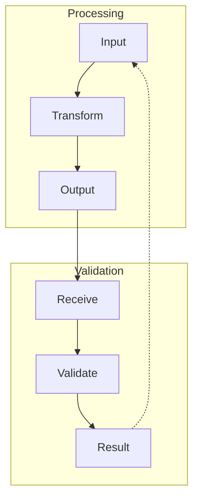

✅ **Subgraph-to-subgraph (compact):**
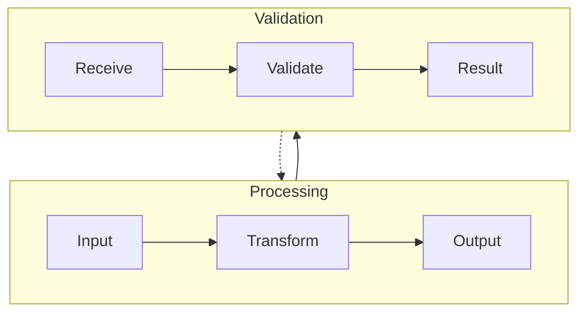

### Principle 3: Subgraph Arrangement (The Single Biggest Layout Issue)

Arranging subgraphs — side-by-side or stacked — is the most common layout problem in Mermaid flowcharts.

> **dagre** (from "directed graph rendering") is the JavaScript layout engine underneath Mermaid. Mermaid handles syntax and styling; dagre makes all spatial decisions — where nodes sit, how edges route, and how subgraphs are arranged. Every layout behavior described in this section is a dagre decision, not a Mermaid decision.

> **Renderer scope:** These layout rules are empirical patterns verified in the claude.ai artifact panel running Mermaid 10.x with dagre layout. Other renderers (VS Code, GitLab, GitHub, Mermaid Live Editor) may behave differently. Treat these as high-value defaults, not mathematical guarantees. When a layout fails, simplify edges, reduce asymmetry, and prefer the fallback patterns listed below.

The `direction` directive on a **parent** subgraph to control **children's arrangement** is not dependable as a sole control mechanism (dagre frequently deprioritizes it when it conflicts with global rank assignments). However, `direction` on **child** subgraphs to control their **internal flow** is respected and critically important — it shapes each child's aspect ratio, which indirectly influences how dagre arranges peers. For simple pipeline layouts, the most reliable observed pattern is **container subgraphs with external rank-forcing edges**, combined with **`direction` on children** to control internal flow. For **grid layouts** (2×2 or N×M), parent `direction` combined with child `direction` and `~~~` ordering links is the most reliable currently-known pattern (see Technique 5).

#### The Core Problem

When you set `direction LR` inside a **parent** subgraph to arrange its **children** side by side, dagre often deprioritizes it and stacks children vertically. The `direction` directive on a parent is a *weak hint* that dagre may disregard when it conflicts with edge-derived rank assignments.

However, `direction` on a **child** subgraph controls that child's **internal flow** — and this IS respected. This matters because a child's internal flow determines its aspect ratio (tall/narrow vs short/wide), and aspect ratio influences how dagre arranges peer subgraphs.

**The key distinction:**

| `direction` applied to | Purpose | Reliability |
|----------------------|---------|-------------|
| **Parent** subgraph (alone) | Arrange children side-by-side or stacked | ⚠️ Weak hint — not dependable as sole arrangement mechanism |
| **Parent** subgraph + child `direction` + `~~~` ordering | Grid layout arrangement (2×2, N×M) | ✅ Most reliable observed pattern (see Technique 5) |
| **Child** subgraph | Control internal flow within that child | ✅ Reliable — shapes aspect ratio, indirectly influences peer arrangement |

#### ⚠️ Critical Warning: Cross-Boundary Edges and Interior Targets

**Quick Rule:** If you write `External --> Something`, that "Something" must be a **subgraph ID**, not a node inside it.

**Read this before applying any technique.** This is the most common cause of layout failure.

When edges from **outside** a container target **leaf nodes** inside that container, dagre assigns those leaf nodes their own rank based on the external edge — overriding the container's internal `direction` arrangement. This pulls siblings out of side-by-side positioning and stacks them vertically.

**The key distinction: subgraph targets vs leaf-node targets.**

| Target type | Example | Safe? |
|-------------|---------|-------|
| Child **subgraph** inside container | `External --> PathA` (PathA is a subgraph) | ✅ Safe — dagre treats subgraph-level rank assignment differently |
| **Leaf node** inside directional container | `External --> NodeX` (NodeX is a node inside a subgraph with `direction` set) | ❌ Unsafe — external rank overrides internal arrangement |
| Container subgraph itself | `StepA --> Container` | ✅ Safe — subgraph-to-subgraph connection |

❌ **Breaks BottomRow's side-by-side arrangement:**
```mermaid
    TopRow --> BottomRow
    TopRow --> ChildC       %% ChildC is a leaf node inside BottomRow
    TopRow --> ChildD       %% ChildD is a leaf node inside BottomRow
```

✅ **Preserves arrangement:**
```mermaid
    TopRow --> BottomRow    %% subgraph-to-subgraph only
```

**Technique 2 is safe** because its external edges target child **subgraphs** (e.g., `Reality --> PathA`), not leaf nodes. The failure mode occurs when you target **leaf nodes inside a subgraph that has its own `direction` set**.

**Rule:** When crossing container boundaries, target subgraphs, not their contents.

#### The Reliable Solution: Container + External Edges

The pattern that works consistently for **both** side-by-side and stacked arrangements:

1. **Use a visible container subgraph** to group related children and provide semantic context (e.g., `subgraph x["INTERPRETATION PATHWAYS"]`)
2. **Place rank-forcing edges from a node OUTSIDE the container** into the children inside it — this is what actually controls arrangement
3. **Use a transparent wrapper subgraph** for elements that should float above or outside the container (titles, headers) while still participating in layout

**Why it works:** Dagre determines rank from edges. When an external node connects to multiple children inside a container, dagre assigns them equal rank. In a `flowchart TB`, equal-rank subgraphs are placed side by side. In a `flowchart LR`, they stack vertically. The container provides the visual border; the external edges provide the layout control.

#### Technique 1: Transparent Wrapper for Floating Elements

Use `subgraph y[" "]` with transparent styling to hold title nodes or header elements outside the main visual container:

```mermaid
subgraph y[" "]
    direction TB
    Title["Diagram Title"]
    HeaderNode["Key context"]
    Title ~~~ HeaderNode
end
style y fill:transparent,stroke:transparent,stroke-width:0px
```

This lets elements float cleanly above a container without being boxed inside it.

#### Technique 2: Side-by-Side via Container + External Edges

Place peer subgraphs inside a visible container. Connect to them from an external node:

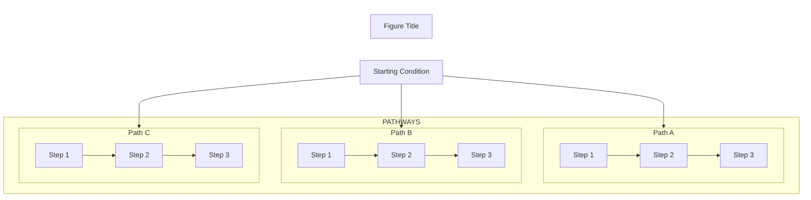

**Key:** The edges from `Reality` (outside `x`) into `PathA`, `PathB`, `PathC` (inside `x`) usually encourage equal-rank placement. In `flowchart TB`, this often yields side-by-side arrangement when child aspect ratios are compatible. Note: these external edges target child **subgraphs** — this is safe per the Critical Warning above. If peers still stack, add `direction TB` inside each child to make them narrower (Technique 4).

#### Technique 3: Stacked Arrangement via Container + Sequential Edges

The same container pattern works for stacked (vertical) arrangements. Instead of connecting all children to the same external node, connect them in sequence:

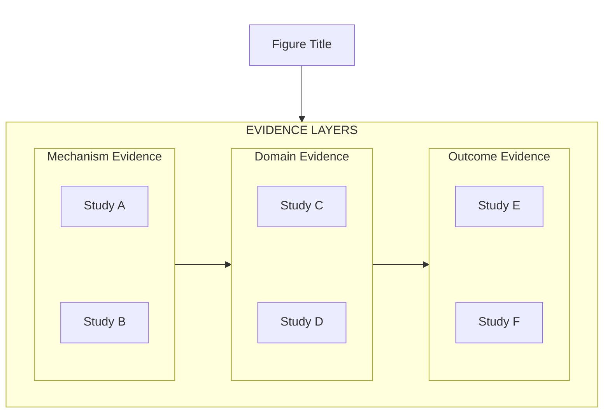

**Key:** Sequential edges (`Layer1 --> Layer2 --> Layer3`) assign different ranks, forcing vertical stacking. Within each layer, `~~~` links keep peer nodes side by side.

#### Technique 4: `direction` on Children for Aspect Ratio Control

Use `direction TB` inside each **child** subgraph to make its internal content flow vertically. This makes each child taller and narrower, which causes dagre to place peer subgraphs side by side (because they fit horizontally). Without `direction TB`, node chains default to flowing horizontally, making each child wider, which triggers vertical stacking.

**This is the single most impactful layout technique for side-by-side arrangements.**

✅ **With `direction TB` on children — peers render side by side:**
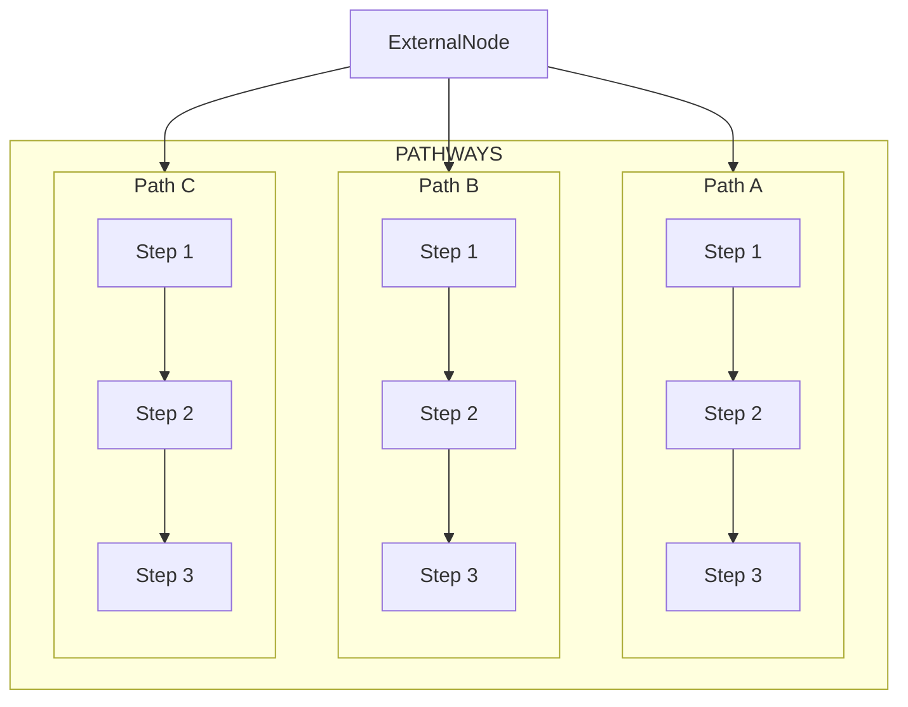

**Why it works:** `direction TB` forces each path's nodes into a vertical column. Three narrow vertical columns fit side by side. Without `direction TB`, the nodes chain horizontally, creating wide subgraphs that dagre stacks vertically to fit.

**Combine with external edges for stronger control:** `direction TB` on children shapes aspect ratio. External edges from a common node encourage equal rank. Together, they produce the most consistent side-by-side arrangement observed in testing.

#### Technique 5: Grid Layout (2×2 or N×M)

For arrangements where multiple rows each contain side-by-side subgraphs (e.g., a 2×2 quadrant diagram), the container + external edges pattern from Technique 2 does NOT work — because external edges targeting interior nodes of a container **break the container's internal arrangement** (see Critical Warning above). Instead, use parent `direction LR` on each row container, child `direction TB` for aspect ratio, and `~~~` for left-right ordering.

**The pattern:**

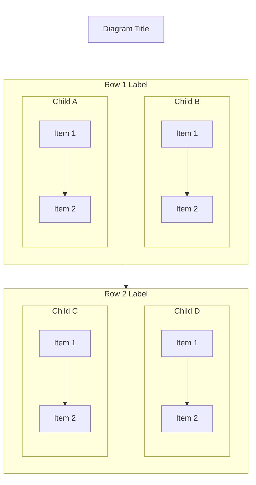

**Why it works — three mechanisms combine:**
1. **`direction LR` on each row container** — hints dagre to arrange children horizontally within the row
2. **`direction TB` on each child** — makes children tall/narrow, fitting side by side
3. **`ChildA ~~~ ChildB`** — tends to preserve left-to-right ordering consistent with declaration order (verify visually — the ordering heuristic is non-deterministic)

**Critical rules for grid layouts:**
- Connect rows to each other with **subgraph-to-subgraph edges only** (`Row1 --> Row2`). Never target leaf nodes across row boundaries.
- Use `~~~` (not `-->`) from title/header nodes to avoid unwanted visible arrows.
- The `~~~` link between siblings inside a row tends to preserve declaration-order positioning — declare the left sibling first in the `~~~` expression.
- If exact ordering matters, combine `~~~` with row containers and keep sibling structure symmetric.

#### Technique 6: Hub-and-Spoke (Radial Approximation)

For diagrams with a central concept and N satellite nodes (e.g., "Core API with 5 services," "Central thesis with supporting arguments"), do NOT use grid or pipeline techniques — they force rigid structures that look wrong for radial concepts.

**The pattern:** Place the central node at top level. Connect it with subgraph-level edges to spoke containers. Do not wrap spokes in a parent container unless semantic grouping requires it.

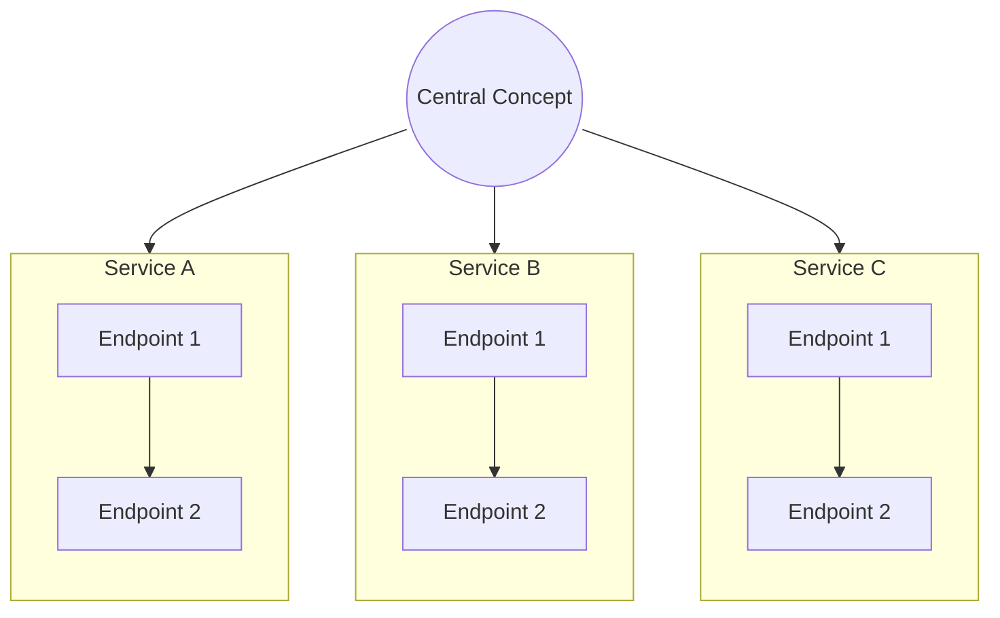

**Key:** No container wrapping the spokes. The hub's edges to each spoke usually encourage equal rank placement. Use `direction TB` inside spokes to keep them narrow.

**Scale threshold:** For **>5 spokes**, the layout becomes too wide for most media. Transition to a hybrid: place spokes in row containers (Technique 5 variant) with 3-4 spokes per row, stacked vertically. Or split into two hub-and-spoke diagrams (primary hub + secondary hub).

**Asymmetric composite layouts** (e.g., 1 wide row + 2 narrow below) are a variant of Technique 5: build stacked row containers where each row may have a different number of children. Use `direction LR` on each row, `~~~` inside each row for ordering, and `Row1 --> Row2` between rows.

**Asymmetric example (1 wide + 2 narrow):**
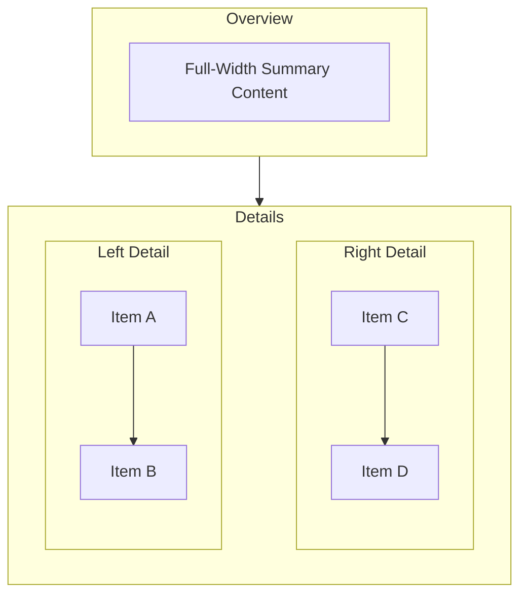

**Key:** Row1 has 1 child (naturally spans full width). Row2 has 2 children with `direction TB` (narrower, side by side). Subgraph-to-subgraph stacking only.

#### When to Use Which Technique

| Goal | Technique | Pattern |
|------|-----------|---------|
| Peer subgraphs side by side | Container + external edges from ONE node to ALL child **subgraphs** + `direction TB` inside each child | `External --> ChildA`, `External --> ChildB` + `direction TB` in each child |
| Peer subgraphs stacked vertically | Container + sequential edges between children | `Child1 --> Child2 --> Child3` |
| **Grid layout (2×2, N×M)** | **Row containers with `direction LR` + child `direction TB` + `~~~` ordering + subgraph-to-subgraph stacking** | **`direction LR` on rows, `direction TB` on children, `ChildA ~~~ ChildB` inside rows, `Row1 --> Row2` between rows** |
| **Hub-and-spoke / radial** | **Central node at top level + subgraph-level edges to spoke containers** | **`Hub --> SpokeA`, `Hub --> SpokeB` + `direction TB` in spokes; no parent container** |
| Asymmetric composite (1 wide + 2 narrow) | Stacked row containers; each row may have different child count | Variant of T5: `direction LR` on each row, `~~~` inside, `Row1 --> Row2` between |
| Mixed (some side by side, some stacked) | Combine both — same-source edges for horizontal peers, sequential edges for vertical ordering | Mix patterns as needed |
| Elements floating outside container | Transparent wrapper subgraph | `style y fill:transparent,stroke:transparent,stroke-width:0px` |
| Control child internal flow | `direction TB` or `direction LR` inside the **child** subgraph (not the parent) | `direction TB` for vertical internal flow, `direction LR` for horizontal |
| Decorative/title connection (no visible arrow) | `~~~` invisible link | `TitleNode ~~~ TargetSubgraph` |

#### What NOT to Do

❌ Do not rely on `direction LR` or `direction TB` on a **parent** subgraph **alone** to arrange its **children** — without additional constraints (child `direction`, `~~~` ordering, or external edges), dagre may deprioritize it.

✅ DO use `direction TB` or `direction LR` on **child** subgraphs to control their **internal flow** — this is respected and shapes aspect ratio, which influences peer arrangement.

✅ DO use parent `direction LR` **combined with** child `direction TB` and `~~~` ordering for grid layouts — this is the most reliable observed pattern (see Technique 5).

❌ Do not use edges from outside a container that target **leaf nodes** inside that container when the container uses `direction` for internal arrangement — external rank constraints override the container's arrangement. Target child **subgraphs** instead (see Critical Warning above).

❌ Do not flatten everything to the top level and lose semantic grouping — containers with visible borders communicate structure to the reader.

❌ Do not use `~~~` invisible links as the *primary* layout mechanism for pipeline layouts — they hint at arrangement but don't establish it. Use edges from external nodes as the primary rank signal. However, `~~~` IS essential for **controlling sibling order** inside row containers (grid layouts).

❌ Do not use `-->` (visible arrows) to connect decorative elements like titles or headers to content subgraphs — use `~~~` invisible links to position without creating unwanted flow arrows.

#### Safe Fallback Default

**When uncertain which technique to use, default to Technique 3 (stacked pipeline with sequential subgraph-to-subgraph edges).** It is the simplest layout pattern, works reliably with dagre, and produces readable output for most diagram types. You can always refine to a more sophisticated technique after the basic structure renders correctly.

**For simple diagrams (≤5 nodes), skip subgraphs entirely** — use a flat flowchart with direct node connections. Subgraphs add layout complexity that small diagrams don't need. (Note: the title-wrapper subgraph from the boilerplate is a display mechanism, not a layout subgraph — it doesn't count against this threshold and may still be used.)

**Guiding principle: prefer the simplest diagram that communicates the idea.**


### Combined Effect: Aspect Ratio Control

| Parent Flow | Child Direction | Connection Level | Resulting Shape |
|------------|----------------|-----------------|----------------|
| TB | LR | Subgraph-to-subgraph | **Balanced (~1:1 to 2:1)** — fits pages and slides |
| TB | TB | Node-to-node | **Tall/narrow (~3:1 to 5:1)** — overflows pages |
| LR | TB | Subgraph-to-subgraph | **Wide (~1:2)** — good for slides, bad for pages |
| LR | LR | Node-to-node | **Very wide** — overflows most media |

**Target Aspect Ratios by Medium:**

| Medium | Target Aspect Ratio | Recommended Strategy |
|--------|--------------------|---------------------|
| Print page (portrait) | ~1:1.3 | TB parent + LR children |
| Presentation slide | ~1.6:1 | LR parent + TB children |
| Web embed (responsive) | ~1:1 to 1.5:1 | TB parent + LR children |
| Documentation panel | ~1:2 | TB parent + LR children + more steps |

---

## Advanced Layout Techniques

These techniques solve persistent Mermaid layout challenges discovered through intensive production diagram development. Use when standard approaches produce undesirable results.

### Invisible Elements Toolkit

Before applying advanced techniques, define these utility classes:

```mermaid
%% Invisible container - for parent subgraphs that control layout only
classDef invisibleContainer fill:transparent,stroke:transparent,stroke-width:0px

%% Fully invisible - for padding nodes and artifact anchors
classDef invisible fill:transparent,stroke:transparent,stroke-width:0px,color:transparent
```

### 1. Subgraph Horizontal Alignment

**Problem:** Multiple subgraphs stack vertically (stair-step pattern) instead of side-by-side, even with `flowchart LR`. Mermaid provides no direct control over subgraph-level layout.

**Solution:** Wrap child subgraphs in an invisible parent container with `direction LR`:

```mermaid
flowchart TB

    subgraph Container[" "]
        direction LR
        
        subgraph Phase1["PHASE 1"]
            direction LR
            P1_Node1[Task A]
            P1_Node2[Task B]
        end

        Phase1 ==> Phase2

        subgraph Phase2["PHASE 2"]
            direction LR
            P2_Node1[Task C]
            P2_Node2[Task D]
        end
    end

classDef invisibleContainer fill:transparent,stroke:transparent,stroke-width:0px
class Container invisibleContainer
```

**Key Insights:**
- The invisible parent container (`Container[" "]`) groups child subgraphs for layout purposes without a visible border
- Child subgraphs are arranged side by side because the `==>` edges between them establish sequential rank within the container
- **Note:** This example uses same-grain direction (`direction LR` on both parent and children), which works here because the `==>` edges between phases are the primary layout driver, not the parent `direction`. For new diagrams, prefer cross-grain direction (Principle 1) unless explicit edges between children control the arrangement.
- Use `==>` between child subgraph IDs to create visible flow arrows
- Empty title `[" "]` (space in quotes) prevents title rendering while maintaining valid syntax

### 2. Minimum Node Width Control

**Problem:** Mermaid auto-calculates node width from text content. No native `min-width` property exists. Short text creates narrow nodes; text wraps awkwardly mid-phrase.

**Solution:** Add invisible padding nodes using Braille blank character (U+2800) and the `~~~` invisible link operator:

```mermaid
flowchart LR
    Pad1["⠀⠀⠀⠀"] ~~~ ContentNode["Your Visible Text Here"] ~~~ Pad2["⠀⠀⠀⠀"]

classDef invisible fill:transparent,stroke:transparent,stroke-width:0px,color:transparent
class Pad1,Pad2 invisible
```

**Key Insights:**
- Braille blank `⠀` (U+2800) has width but no visible glyph — use multiple characters for wider padding
- The `~~~` operator positions nodes adjacent without any visible connector line
- Padding nodes expand the effective width of the containing subgraph
- Apply `invisible` class to hide padding nodes completely

**Copying U+2800:** The Braille blank character appears as whitespace but is NOT a standard space. Copy it directly from this documentation or use:
- Unicode: U+2800
- HTML entity: `&#10240;`
- In code: `\u2800`

**Fallback if Braille blanks are stripped:** Some tokenizers or text processors may strip unusual Unicode characters. If Braille blanks disappear, use non-breaking spaces (`&nbsp;`) inside node labels with `color:transparent` on the invisible class, or use multiple dots (`...`) with the invisible class applied.

### 3. Routing Line Artifact Mitigation

**Problem:** Horizontal lines appear attached to visible nodes — artifacts of Mermaid's internal layout engine routing infrastructure. These stray lines are most visible on leftmost diagram elements.

**Solution:** Add an invisible anchor row as the **first element** in the leftmost subgraph:

```mermaid
flowchart TB
    subgraph FirstSubgraph["My Subgraph"]
        direction LR
        Anchor1["⠀"] ~~~ Anchor2["⠀"] ~~~ Anchor3["⠀"]
        
        VisibleNode1["Actual Content"]
        VisibleNode2["More Content"]
    end

classDef invisible fill:transparent,stroke:transparent,stroke-width:0px,color:transparent
class Anchor1,Anchor2,Anchor3 invisible
```

**Key Insights:**
- The first-defined node row in the leftmost subgraph becomes Mermaid's layout anchor point
- Making that row invisible absorbs routing artifacts that would otherwise attach to visible nodes
- Use single Braille blanks `["⠀"]` for minimal-width anchors
- Connect anchors with `~~~` to form a horizontal absorption row

### 4. Subgraph-to-Subgraph Flow Control

**Problem:** Need to control both visual flow arrows AND layout alignment between subgraphs independently.

**Solution:** Choose the appropriate linking strategy based on requirements:

```mermaid
%% Option A: Visible flow arrow between subgraphs
SubgraphA ==> SubgraphB

%% Option B: Invisible link for layout-only alignment (no arrow shown)
SubgraphA ~~~ SubgraphB

%% Option C: Create link for layout, then hide it
SubgraphA ==> SubgraphB
linkStyle 0 stroke:transparent,stroke-width:0px
```

**When to Use Each:**
| Option | Use Case |
|--------|----------|
| `==>` | Show explicit flow/progression between phases |
| `~~~` | Force horizontal alignment without visible connection |
| `linkStyle ... transparent` | When you need the layout effect of a link but want it hidden |

**linkStyle Index:** The number after `linkStyle` is the zero-based index of the link in order of definition. Count your links from the top of the diagram to determine the correct index.

### Combined Example: Multi-Phase Timeline

This pattern combines Techniques 1, 2, 3, and 4 for complex timeline or phase-based diagrams:

```mermaid
%%mdg:DGM:1.0%%
%%{init: {'theme': 'default', 'themeVariables': { 'fontSize': '16px' }}}%%

flowchart TB

    subgraph Timeline[" "]
        direction LR
        
        subgraph Phase1["Q1: Foundation"]
            direction LR
            P1_Anchor["⠀"] ~~~ P1_Pad1["⠀⠀"] ~~~ P1_Anchor2["⠀"]
            P1_Task1[Infrastructure Setup]
            P1_Task2[Team Onboarding]
        end
        
        Phase1 ==> Phase2
        
        subgraph Phase2["Q2: Development"]
            direction LR
            P2_Task1[Core Features]
            P2_Task2[Testing Framework]
        end
        
        Phase2 ==> Phase3
        
        subgraph Phase3["Q3: Launch"]
            direction LR
            P3_Task1[Beta Release]
            P3_Task2[GA Release]
        end
    end

classDef invisibleContainer fill:transparent,stroke:transparent,stroke-width:0px
classDef invisible fill:transparent,stroke:transparent,stroke-width:0px,color:transparent
classDef phase1Style fill:#E0E8FF,stroke:#3050C8,stroke-width:2px,color:#000000
classDef phase2Style fill:#E0FFE8,stroke:#30C850,stroke-width:2px,color:#000000
classDef phase3Style fill:#F0E0FF,stroke:#8030C8,stroke-width:2px,color:#000000

class Timeline invisibleContainer
class P1_Anchor,P1_Pad1,P1_Anchor2 invisible
class P1_Task1,P1_Task2 phase1Style
class P2_Task1,P2_Task2 phase2Style
class P3_Task1,P3_Task2 phase3Style

style Phase1 fill:#F5F8FF,stroke:#3050C8,stroke-width:2px,color:#1a1a1a,font-weight:bold
style Phase2 fill:#F5FFF8,stroke:#30C850,stroke-width:2px,color:#1a1a1a,font-weight:bold
style Phase3 fill:#F8F5FF,stroke:#8030C8,stroke-width:2px,color:#1a1a1a,font-weight:bold
```


---

## Working with Complex Diagrams

When diagrams exceed 60 nodes or 100 edges:

1. **Split into multiple diagrams**: Create overview + detail diagrams
2. **Use hierarchical grouping**: Nested subgraphs for visual organization
3. **Apply consistent naming**: Use same identifiers across related diagrams
4. **Add cross-references**: Use labeled edges for "See Details" links
5. **Apply advanced layout techniques**: Use invisible containers and anchors for precise control
6. **Apply page-fit strategy**: Cross-grain direction + subgraph-level connections

### How to Split Large Diagrams

Split along one of these axes (choose the one that produces the most self-contained sub-diagrams):

| Split Axis | When to Use | Example |
|-----------|-------------|---------|
| **By domain/subsystem** | Architecture diagrams with clear boundaries | Auth system, Payment system, Notification system — one diagram each |
| **By phase/sequence** | Process flows with distinct stages | Planning → Development → Testing → Launch — one diagram per phase |
| **By layer** | Systems with horizontal tiers | Overview diagram + detail diagrams for each layer (frontend, backend, data) |
| **By audience** | Different stakeholders need different views | Executive summary diagram + engineering detail diagram |

**The overview + detail pattern:** Create one high-level diagram showing containers/subsystems as single nodes. Then create one detail diagram per container showing internal structure. Label the overview nodes with "See: [Detail Diagram Name]".

### For 40–60 Node Diagrams

At this scale, layout techniques become less predictable:
- Reduce color families to 2–3
- Avoid node-to-node cross-container edges unless essential
- Keep each row/container semantically uniform
- Prefer overview + detail split if any container exceeds ~8 internal nodes
- Avoid mixing layout techniques in one diagram

### Deep Nesting Rule

Limit subgraph nesting to **2 levels maximum** (parent → child → grandchild). If a design would require 3+ nesting levels, transform it:

1. **Flatten the innermost layer** — convert the deepest subgraphs into labeled nodes rather than containers
2. **Or split into overview + detail** — the overview shows the outer two levels; detail diagrams show the inner structure of each mid-level container

Deeply nested subgraphs compound layout unpredictability — each nesting level multiplies the chance that dagre's rank resolution produces unexpected results.

---

## Layout Troubleshooting

When a rendered diagram looks wrong, use this checklist before attempting complex fixes.

| Symptom | Likely Cause | Fix |
|---------|-------------|-----|
| **Text invisible** | Missing `color:#000000` in `classDef` or node not assigned a class | Re-check Emergency Rule 2; verify `class NodeID styleName` is present |
| **Subgraph title invisible** | Missing or light `color` in `style SubgraphID` | Add `color:#1a1a1a,font-weight:bold` to subgraph `style` directive |
| **Stair-step / tall layout** | Same-grain direction (parent and children both TB) | Apply Principle 1: cross-grain direction (TB parent + LR children) |
| **Siblings stacking when they should be side by side** | Missing `direction TB` on children, or edges not forcing equal rank | Apply Technique 4 (`direction TB` on children); add external common-source edges (T2) |
| **Siblings reversed (right before left)** | dagre ordering heuristic | Add `ChildA ~~~ ChildB` inside the row container |
| **Grid layout broken** | Cross-boundary edges targeting leaf nodes inside row containers | Remove interior-targeting edges; use subgraph-to-subgraph connections only (T5) |
| **Syntax error** | Spaces in subgraph ID, or unmatched `end` | Check Emergency Rule 4; verify all subgraph/end pairs |
| **Arrows routing diagonally or crossing** | Node-to-node connections across containers | Simplify to subgraph-to-subgraph connections (Principle 2) |
| **Diagram too wide or too tall** | Wrong direction or too many nodes in one axis | Check aspect ratio table; consider splitting (see How to Split) |

**When all else fails:**
1. Reduce diagram scope by 50%
2. Remove all advanced layout techniques (invisible nodes, padding, `~~~`)
3. Use Technique 3 (sequential stacking) as fallback
4. Render a minimal version, then expand incrementally

---

## ELK Layout Engine (Alternative to dagre)

**All layout techniques in this file (Principles 1-3, Techniques 1-6) are optimized for dagre**, which is the default Mermaid layout engine and the only one available in claude.ai artifacts. However, an alternative engine — **ELK (Eclipse Layout Kernel)** — exists and may produce better results for complex diagrams when available.

### When to Consider ELK

- Diagram has 30+ nodes with complex subgraph nesting
- Grid/quadrant layouts that fight dagre despite Technique 5
- Hub-and-spoke patterns with many spokes
- Any case where dagre workarounds (external edges, `~~~` ordering, invisible wrappers) feel excessive

### How to Activate ELK

ELK requires `@mermaid-js/layout-elk` to be loaded in the rendering environment. It is **NOT available** in claude.ai artifacts, basic GitHub rendering, or most hosted Mermaid viewers. It IS available in: Mermaid Live Editor (mermaid.js.org), local setups with the package installed, and some platforms that bundle it.

**Activation via frontmatter:**
```mermaid
---
config:
  layout: elk
---
flowchart TB
    ...
```

**Or via init:**
```mermaid
%%{init: {'flowchart': {'defaultRenderer': 'elk'}}}%%
```

### Key Behavioral Differences from dagre

| Behavior | dagre | ELK (layered) |
|----------|-------|---------------|
| Parent `direction` for child arrangement | Weak hint — often ignored | Generally more respected, but still limited by external connections |
| Cross-boundary edges to interior nodes | Overrides internal arrangement (Critical Warning) | Handles more holistically — less severe but still test |
| `~~~` invisible links | Useful for ordering hints | May render visibly or behave inconsistently — use sparingly |
| Subgraph/cluster handling | Basic — requires manual techniques | More advanced compound node support |
| Compactness for large diagrams | Degrades above ~30 nodes | Better optimization for 40-60+ nodes |
| Aspect ratio control | Requires cross-grain + padding hacks | Tends to produce more balanced output natively |

### Decision Rule

**ONLY use ELK if the user explicitly requests it OR the target environment is confirmed to support it.** Do not speculatively attempt ELK.

**If the user explicitly requests ELK AND diagram is complex:**
1. Remove all `~~~` invisible links (they may render visibly in ELK)
2. Remove external rank-forcing edges — rely on `direction` + subgraph hierarchy
3. Use basic `direction` (TB or LR) on parent and children
4. Rely on ELK's native subgraph/compound node support
5. Test and compare with dagre version

**If ELK produces worse results** → fall back to dagre + full Principle 3 techniques

**If generating for claude.ai artifacts:** ELK is not available. Use dagre techniques exclusively. Do not add ELK configuration.

### ELK-Specific Anti-Patterns

- ❌ Do not use `~~~` as primary layout control in ELK — it may render visibly
- ❌ Do not assume ELK is available — always have a dagre fallback
- ❌ Do not mix ELK-specific config with dagre-optimized layout hacks — choose one engine and optimize for it

---

## Sequence Diagrams

Sequence diagrams show interactions between actors/systems over time. They are ideal for API flows, protocol handshakes, authentication sequences, and message-passing architectures.

### sequenceDiagram Boilerplate

```mermaid
%%mdg:DGM:1.0%%
%%{init: {'theme': 'default', 'themeVariables': { 'fontSize': '16px', 'actorTextColor': '#000000', 'signalColor': '#333333', 'signalTextColor': '#000000', 'noteBkgColor': '#FFF9E0', 'noteTextColor': '#000000', 'noteBorderColor': '#C88030' }}}%%
%% Date: YYYY-MM-DD
%% Title: Diagram Title
%% MDG Version: 1.0

sequenceDiagram
    title API Authentication Flow

    participant C as Client
    participant A as Auth Server
    participant R as Resource Server

    C->>+A: POST /token (credentials)
    A-->>-C: 200 OK (access_token)

    C->>+R: GET /data (Bearer token)
    R->>+A: Validate token
    A-->>-R: Token valid
    R-->>-C: 200 OK (data)
```

**Activation shorthand:** Use `+` and `-` inline instead of manual `activate`/`deactivate` lines. The `+` on a request arrow (`->>+`) activates the target; the `-` on a response arrow (`-->>-`) deactivates it. This prevents orphaned activation bars, which are the most common sequence diagram rendering artifact.

### Key Syntax Reference

| Element | Syntax | Use |
|---------|--------|-----|
| Participant | `participant P as "Display Name"` | Declare actors/systems |
| Actor (person icon) | `actor U as "User"` | Declare human actors |
| Solid arrow (request) | `->>` | Synchronous call |
| Dashed arrow (response) | `-->>` | Return/response |
| Solid arrow (no head) | `->` | Async message |
| Dashed arrow (no head) | `-->` | Async response |
| Cross endpoint | `-x` | Lost message |
| Activation (shorthand) | `->>+` / `-->>-` | **Preferred** — activate on request, deactivate on response |
| Activation (manual) | `activate P` / `deactivate P` | Use only when shorthand won't work (e.g., self-calls) |
| Note right | `Note right of P: text` | Annotation |
| Note over | `Note over P1,P2: text` | Spanning note |
| Alt block | `alt condition` ... `else` ... `end` | Conditional logic |
| Loop block | `loop description` ... `end` | Repeated interaction |
| Opt block | `opt description` ... `end` | Optional interaction |
| Par block | `par description` ... `and` ... `end` | Parallel interactions |
| Critical block | `critical description` ... `option fallback` ... `end` | Critical with fallback |
| Break block | `break condition` ... `end` | Break out of flow |
| Rect highlight | `rect rgb(240,240,255)` ... `end` | Highlight region |

### Sequence Diagram Best Practices

1. **Title is mandatory** — always include `title Your Title` as the first line after `sequenceDiagram`
2. **Use `+`/`-` activation shorthand** (`->>+` and `-->>-`) instead of manual `activate`/`deactivate` — shorthand prevents orphaned activation bars
3. **Limit participants to 6–8** — more creates horizontal sprawl; split into multiple diagrams
4. **Limit messages to ~20 interactions** — if longer, split into phase diagrams (e.g., "Phase 1: Auth", "Phase 2: Data Fetch")
5. **Use `alt`/`else` blocks** sparingly — deeply nested conditionals become unreadable; consider splitting
6. **Use `rect` highlights** to visually group related message exchanges (e.g., "Authentication Phase")
7. **Notes for context** — place notes to explain non-obvious protocol details or business rules
8. **Participant ordering** — declare participants in the order that minimizes arrow crossings (typically left-to-right matches the primary flow direction)
9. **Number steps for complex flows** — prefix messages with step numbers: `1. Initiate request`
10. **Keep message labels concise** — use `POST /token` not `Send HTTP POST request to the token endpoint`

### Splitting Guidance for Complex Sequences

If a sequence needs **more than 8 participants** or **more than 2 nested control blocks**, split it:
- **Happy-path diagram** — the primary success flow
- **Error/exception diagram(s)** — separate alt/opt flows for failures, timeouts, retries
- **Phase diagrams** — break by logical phase (auth → data fetch → cleanup)

### Sequence Diagram Anti-Patterns

- ❌ More than 3 levels of nested `alt`/`loop`/`opt` blocks — split the diagram
- ❌ Unlabeled arrows — every arrow should describe what is being sent/returned
- ❌ Manual `activate`/`deactivate` lines when `+`/`-` shorthand would work — shorthand is harder to orphan
- ❌ Overly long message labels that wrap unpredictably
- ❌ More than 20 messages in a single diagram — readers lose track; split into phases

---

## Entity Relationship Diagrams (ERD)

ER diagrams show database entities, their attributes, and relationships. Use for data modeling, schema documentation, and database design.

### erDiagram Boilerplate

```mermaid
%%mdg:DGM:1.0%%
%%{init: {'theme': 'default', 'themeVariables': { 'fontSize': '14px' }}}%%
%% Date: YYYY-MM-DD
%% Title: Diagram Title
%% MDG Version: 1.0

erDiagram
    title Customer Order Model

    CUSTOMER ||--o{ ORDER : places
    CUSTOMER {
        int customer_id PK
        string name
        string email UK
        date created_at
    }
    ORDER ||--|{ LINE_ITEM : contains
    ORDER {
        int order_id PK
        int customer_id FK
        date order_date
        string status
        decimal total
    }
    LINE_ITEM {
        int line_id PK
        int order_id FK
        int product_id FK
        int quantity
        decimal unit_price
    }
    PRODUCT ||--o{ LINE_ITEM : "appears in"
    PRODUCT {
        int product_id PK
        string name
        string sku UK
        decimal price
        int stock_qty
    }
```

### Relationship Cardinality Syntax

| Syntax | Left Side | Right Side | Meaning |
|--------|-----------|------------|---------|
| `\|\|--\|\|` | Exactly one | Exactly one | One-to-one |
| `\|\|--o{` | Exactly one | Zero or more | One-to-many (optional) |
| `\|\|--\|{` | Exactly one | One or more | One-to-many (required) |
| `o\|--o{` | Zero or one | Zero or more | Optional on both sides |
| `}o--o{` | Zero or more | Zero or more | Many-to-many |

**Reading the symbols:**
- `||` = exactly one (mandatory)
- `o|` = zero or one (optional)
- `|{` = one or more (mandatory many)
- `o{` = zero or more (optional many)

### Attribute Annotations

| Annotation | Meaning | Position |
|-----------|---------|----------|
| `PK` | Primary Key | After type and name |
| `FK` | Foreign Key | After type and name |
| `UK` | Unique Key | After type and name |

### ERD Best Practices

1. **Title is mandatory** — use the `title` directive
2. **Use singular entity names** — `CUSTOMER` not `CUSTOMERS`; entities represent a type, not a collection
3. **Always include PK/FK/UK annotations** — they communicate schema intent at a glance
4. **Use standard SQL-like types** — `int`, `string`, `decimal`, `date`, `boolean`, `text`, `timestamp`
5. **Label every relationship** — the label after `:` describes the verb (e.g., `places`, `contains`, `belongs to`)
6. **Use explicit junction entities for many-to-many** — create a named associative entity (e.g., `ENROLLMENT` between `STUDENT` and `COURSE`) rather than using `}o--o{` directly
7. **Limit to 8–12 entities per diagram** — for larger schemas, create domain-specific sub-diagrams
8. **Group related entities** — place closely related entities near each other (Mermaid auto-layouts but relationship proximity helps)
9. **Place lookup/reference entities at diagram edges** — tables like `STATUS`, `COUNTRY`, `CATEGORY` are supporting context, not the core model

### ERD Anti-Patterns

- ❌ Entities with no attributes — always include at least PK and key business attributes
- ❌ Unlabeled relationships — every line must have a verb label
- ❌ Plural entity names (`ORDERS` instead of `ORDER`) — use singular
- ❌ Direct many-to-many without junction entity — model the associative entity explicitly
- ❌ More than 15 entities — split into bounded context diagrams
- ❌ Mixing logical and physical model concerns in one diagram

---

## State Diagrams

State diagrams model lifecycle states and transitions. Use for workflow status tracking, protocol state machines, UI navigation states, and entity lifecycle models.

### stateDiagram-v2 Boilerplate

```mermaid
%%mdg:DGM:1.0%%
%%{init: {'theme': 'default', 'themeVariables': { 'fontSize': '14px' }}}%%
%% Date: YYYY-MM-DD
%% Title: Order Lifecycle
%% MDG Version: 1.0

stateDiagram-v2
    [*] --> Draft : Create order

    Draft --> Submitted : Submit
    Draft --> Cancelled : Cancel

    Submitted --> Processing : Payment confirmed
    Submitted --> Cancelled : Cancel

    state Processing {
        [*] --> Picking
        Picking --> Packing
        Packing --> Shipping
    }

    Processing --> Shipped : Dispatched
    Shipped --> Delivered : Delivery confirmed
    Shipped --> Returned : Return initiated

    Delivered --> [*]
    Returned --> Refunded : Refund processed
    Refunded --> [*]
    Cancelled --> [*]

    note right of Processing
        Warehouse operations
        are internal substates
    end note
```

### Key Syntax Reference

| Element | Syntax | Use |
|---------|--------|-----|
| Start | `[*] --> State` | Initial state |
| End | `State --> [*]` | Final/terminal state |
| Transition | `StateA --> StateB : Event` | State change with trigger |
| Composite state | `state Parent { ... }` | Nested sub-states |
| Note | `note right of State` ... `end note` | Annotation |
| Fork/Join | `state fork_state <<fork>>` | Parallel branching |
| Choice | `state choice_state <<choice>>` | Conditional branching |
| Direction | `direction LR` or `direction TB` | Layout direction |

### State Diagram Best Practices

1. **Always show start (`[*]`) and end (`[*]`) states** — makes the lifecycle complete
2. **Label every transition** with the event/trigger that causes it
3. **Use composite states** to group related sub-states (e.g., processing sub-steps)
4. **Limit to 10–15 states per diagram** — decompose complex state machines into composite states or multiple diagrams
5. **Include notes** for states with non-obvious entry/exit conditions
6. **Show error/exception paths** — cancelled, failed, and timeout transitions are critical for completeness
7. **Use `<<choice>>` pseudo-states** for conditional routing rather than multiple arrows from one state

### State Diagram Anti-Patterns

- ❌ Unlabeled transitions — every arrow must say what triggers the state change
- ❌ States with no outgoing transitions (except terminal states) — dead-end states indicate incomplete modeling
- ❌ More than 5 transitions from a single state — consider introducing intermediate states or composite states
- ❌ Missing timeout/error transitions — real systems always have failure modes; model them
- ❌ Cycles without exit conditions — every loop must have a way out

### Choice and Timeout Patterns

**Conditional routing with `<<choice>>`:**
```mermaid
stateDiagram-v2
    state PaymentCheck <<choice>>
    Submitted --> PaymentCheck : Validate payment
    PaymentCheck --> Processing : Payment valid
    PaymentCheck --> Rejected : Payment declined
    PaymentCheck --> PendingReview : Flagged for review
```

**Timeout transition:**
```mermaid
stateDiagram-v2
    WaitingForResponse --> TimedOut : 30s timeout
    TimedOut --> Retry : attempts < 3
    TimedOut --> Failed : attempts >= 3
```

---

## Gantt Charts

Gantt charts visualize project timelines, task dependencies, and milestones. Use for project planning, sprint timelines, and release schedules.

### gantt Boilerplate

```mermaid
%%mdg:DGM:1.0%%
%%{init: {'theme': 'default', 'themeVariables': { 'fontSize': '14px' }, 'gantt': { 'titleTopMargin': 25, 'barHeight': 30, 'fontSize': 14 }}}%%
%% Date: YYYY-MM-DD
%% Title: Project Timeline
%% MDG Version: 1.0

gantt
    title Q1 Product Launch Plan
    dateFormat YYYY-MM-DD
    axisFormat %b %d

    section Planning
        %% First task uses a start date; all subsequent tasks use 'after' dependencies
        Requirements gathering   :a1, 2026-01-05, 10d
        Architecture design      :a2, after a1, 7d
        Technical spec review    :milestone, m1, after a2, 0d

    section Development
        Core API development     :b1, after a2, 21d
        Frontend implementation  :b2, after a2, 18d
        Database schema          :b3, after a2, 10d
        Integration testing      :b4, after b1, 7d

    section Launch
        Staging deployment       :c1, after b4, 3d
        UAT                      :c2, after c1, 5d
        Production release       :milestone, m2, after c2, 0d
```

### Key Syntax Reference

| Element | Syntax | Use |
|---------|--------|-----|
| Title | `title Project Name` | **Required** diagram title |
| Date format | `dateFormat YYYY-MM-DD` | Input date format |
| Axis format | `axisFormat %b %d` | Display format on axis |
| Section | `section Name` | Group of related tasks |
| Task | `Task name :id, start, duration` | Basic task |
| After dependency | `Task :id, after otherId, duration` | Task depends on another |
| Milestone | `Name :milestone, id, date, 0d` | Zero-duration milestone |
| Active task | `Task :active, id, start, duration` | Highlighted as in-progress |
| Done task | `Task :done, id, start, duration` | Marked complete |
| Critical task | `Task :crit, id, start, duration` | On critical path |

### Duration Units

| Unit | Example | Meaning |
|------|---------|---------|
| `d` | `10d` | Days |
| `w` | `2w` | Weeks |
| `h` | `8h` | Hours |

### Gantt Best Practices

1. **Title is mandatory** — always use the `title` directive
2. **Use sections** to group related tasks (Planning, Development, Testing, Launch)
3. **Use milestones** for key decision points and deliverables (duration `0d`)
4. **Use `after` dependencies** rather than hardcoded dates wherever possible — the chart adjusts automatically when dates shift
5. **Limit to 20–25 tasks per diagram** — for larger projects, create phase-specific Gantt charts
6. **Use `crit`** tag for critical path tasks to highlight schedule risks
7. **Use `done` and `active`** tags to show current progress

### Gantt Anti-Patterns

- ❌ All tasks with hardcoded start dates instead of dependencies — defeats the purpose of Gantt scheduling
- ❌ No sections — tasks become an undifferentiated list
- ❌ Missing milestones — no visible checkpoints or deliverables
- ❌ Mixing hardcoded and dependency-based dates without reason — use hardcoded dates **only** for immovable external deadlines (e.g., conference date, regulatory deadline); use `after` dependencies for everything else

---

## Mindmap Diagrams

Mindmaps visualize hierarchical topic structures through indentation. Use for brainstorming, knowledge taxonomy, feature decomposition, and topic organization.

### mindmap Boilerplate

```mermaid
%%mdg:DGM:1.0%%
%%{init: {'theme': 'default', 'themeVariables': { 'fontSize': '16px' }}}%%
%% Date: YYYY-MM-DD
%% Title: Topic Hierarchy
%% MDG Version: 1.0

mindmap
    root((Cloud Architecture))
        Compute
            Virtual Machines
            Containers
            Serverless
        Storage
            Object Storage
            Block Storage
            File Systems
        Networking
            VPC
            Load Balancers
            CDN
        Security
            IAM
            Encryption
            Compliance
```

### Key Syntax

| Element | Syntax | Result |
|---------|--------|--------|
| Root (circle) | `root((Text))` | Central topic in circle |
| Default node | `Topic` | Rectangle node |
| Square node | `[Topic]` | Explicit rectangle |
| Rounded node | `(Topic)` | Rounded rectangle |
| Circle node | `((Topic))` | Circle |
| Bang node | `)Topic(` | Burst/explosion shape |
| Cloud node | `))Topic((` | Cloud shape |
| Hexagon node | `{{Topic}}` | Hexagon |

**Hierarchy is defined by indentation** — each additional indent level creates a child node.

### Mindmap Best Practices

1. **Root node is the title** — the central root node serves as the diagram's title; make it descriptive
2. **Limit depth to 3–4 levels** — deeper nesting becomes unreadable
3. **Limit branches to 5–7 from root** — aligns with cognitive chunking limits
4. **Use shapes semantically** — circles for concepts, rectangles for concrete items, rounded for actions
5. **Keep labels short** — 1–3 words per node for clarity
6. **Balance branch sizes** — avoid one branch with 15 children and another with 2

### Mindmap Anti-Patterns

- ❌ More than 5 levels of depth — split into sub-mindmaps
- ❌ Nodes with paragraph-length labels — use brief labels
- ❌ Single root with 15+ direct children — group into intermediate categories

---

## Pie Charts

Pie charts show proportional distribution. Use for budget allocation, survey results, market share, and any percentage-based breakdown.

### pie Boilerplate

```mermaid
%%mdg:DGM:1.0%%
%%{init: {'theme': 'default', 'themeVariables': { 'fontSize': '16px', 'pieTitleTextSize': '20px', 'pieTitleTextColor': '#000000' }}}%%
%% Date: YYYY-MM-DD
%% Title: Distribution Chart
%% MDG Version: 1.0

pie showData
    title Engineering Time Allocation
    "Feature Development" : 40
    "Bug Fixes" : 20
    "Technical Debt" : 15
    "Code Review" : 10
    "Documentation" : 8
    "Meetings" : 7
```

### Key Syntax

| Element | Syntax | Use |
|---------|--------|-----|
| Title | `title Chart Title` | **Required** chart title |
| Show values | `showData` | Display numeric values on slices |
| Data entry | `"Label" : value` | Each slice's label and proportion |

### Pie Chart Best Practices

1. **Title is mandatory** — always use `title`
2. **Use `showData`** to display values — readers shouldn't have to guess proportions
3. **Limit to 6–8 slices** — group smaller items into "Other" if needed
4. **Order slices by size** — largest first for visual clarity
5. **Use descriptive labels** — `"Feature Development"` not `"FD"`
6. **Values don't need to sum to 100** — Mermaid auto-calculates percentages from relative values

### Pie Chart Anti-Patterns

- ❌ More than 10 slices — becomes visually cluttered; consolidate
- ❌ Multiple tiny slices under 3% — group into "Other"
- ❌ Missing title — always required
- ❌ Using pie when precise comparison matters — pie charts show part-to-whole impression, not exact differences; if the user needs to compare similar-sized categories precisely, suggest a bar/column chart instead
- ❌ Categories that are very similar in size (e.g., all ~20%) — the visual provides no insight; suggest a table or bar chart

---

## Class Diagrams

### classDiagram Boilerplate

**CRITICAL**: classDiagram does NOT support `classDef`/`cssClass` styling reliably. Use `themeVariables` instead.

```mermaid
%%mdg:DGM:1.0%%
%%{init: {'theme': 'base', 'themeVariables': { 'fontSize': '14px', 'primaryColor': '#E0E8FF', 'primaryTextColor': '#000000', 'primaryBorderColor': '#3050C8', 'lineColor': '#AAAAAA', 'textColor': '#000000', 'edgeLabelBackground': '#ffffff' }}}%%
%% Date: YYYY-MM-DD
%% Title: Diagram Title
%% MDG Version: 1.0

classDiagram
    direction TB
    
    class Animal {
        +String name
        +int age
        +makeSound()* String
    }
    class Dog {
        +String breed
        +makeSound() String
        +fetch()
    }
    class Cat {
        +boolean indoor
        +makeSound() String
        +purr()
    }
    
    Animal <|-- Dog : extends
    Animal <|-- Cat : extends
```

**Key classDiagram themeVariables:**
- `theme`: Must be `'base'` (not `'default'`)
- `lineColor`: Use light value like `'#AAAAAA'` for visibility on dark backgrounds
- `primaryTextColor`: Set to `'#000000'` for black text
- `textColor`: Set to `'#000000'` for black text
- Do NOT attempt to set `background` — it doesn't work in Claude's rendering environment

### Class Diagram Relationship Syntax

| Syntax | Meaning |
|--------|---------|
| `A <\|-- B` | Inheritance (B extends A) |
| `A *-- B` | Composition (A contains B) |
| `A o-- B` | Aggregation (A has B) |
| `A --> B` | Association |
| `A ..> B` | Dependency |
| `A <\|.. B` | Realization/Implementation |
| `A -- B` | Undirected association |

### Class Diagram Best Practices

1. **Use visibility modifiers** — `+` public, `-` private, `#` protected, `~` package
2. **Show return types** — `+method() ReturnType`
3. **Mark abstract** with `*` — `+method()* ReturnType`
4. **Label relationships** — `A <|-- B : extends` not just `A <|-- B`
5. **Limit to 8–12 classes per diagram** — for larger models, create package-specific diagrams
6. **Cap fields/methods per class at ~8** — if a class needs more, show only the most important members and add a note
7. **Prefer flowchart or ERD** if the user wants conceptual relationships rather than strict UML semantics — class diagrams in Mermaid become brittle when overloaded

### Class Diagram Anti-Patterns

- ❌ Classes with 15+ fields/methods — becomes unreadable; show key members only
- ❌ Unlabeled relationships — always include `: extends`, `: implements`, `: uses`, etc.
- ❌ Mixing packages/domains in one diagram — split by bounded context
- ❌ Expecting custom styling — classDiagram does NOT support `classDef`; use `themeVariables` only
- ❌ More than 12 classes — split into package diagrams with cross-references


---


## Color Palettes

These palettes aim for WCAG 2.1 AA contrast (≥4.5:1 for normal text) by enforcing dark text (`color:#000000`) on light pastel fills. Verify contrast in your target rendering environment when accessibility is critical. When choosing colors outside these palettes, maintain the dark-text-on-light-fill pattern and verify contrast ratio ≥ 4.5:1 for normal text, ≥ 3:1 for large text (18pt+ or 14pt+ bold).

### flowchart Standard Palette

**CRITICAL**: Every classDef MUST include `color:#000000` for text visibility.

```mermaid
classDef primary fill:#E0E8FF,stroke:#3050C8,stroke-width:2px,color:#000000
classDef secondary fill:#FFE0E8,stroke:#C83050,stroke-width:2px,color:#000000
classDef tertiary fill:#E0FFE8,stroke:#30C850,stroke-width:2px,color:#000000
classDef abstract fill:#F0E0FF,stroke:#8030C8,stroke-width:2px,color:#000000
classDef integration fill:#FFF0E0,stroke:#C88030,stroke-width:2px,color:#000000
```

| Color | Semantic Use |
|-------|--------------|
| Primary (blue) | Structure, organization, core entities |
| Secondary (pink) | Evaluation, alerts, junctions |
| Tertiary (green) | Process, transformation, claims |
| Abstract (purple) | Concepts, generative, activities |
| Integration (orange) | External, meta, coordinates |

### flowchart Subgraph Background Palette

Use these lighter fills for subgraph containers to create visual hierarchy:

```mermaid
style PrimaryGroup fill:#F5F8FF,stroke:#3050C8,stroke-width:2px,color:#1a1a1a,font-weight:bold
style SecondaryGroup fill:#FFF5F8,stroke:#C83050,stroke-width:2px,color:#1a1a1a,font-weight:bold
style TertiaryGroup fill:#F5FFF8,stroke:#30C850,stroke-width:2px,color:#1a1a1a,font-weight:bold
style AbstractGroup fill:#F8F5FF,stroke:#8030C8,stroke-width:2px,color:#1a1a1a,font-weight:bold
style IntegrationGroup fill:#FFFAF5,stroke:#C88030,stroke-width:2px,color:#1a1a1a,font-weight:bold
```

### flowchart Color-Blind Friendly Palette

This palette avoids red/green co-occurrence (the pair most affected by deuteranopia and protanopia, ~8% of males). Do not rely on color alone — use labels, grouping, and edge semantics redundantly.

```mermaid
classDef cb-primary fill:#D5E8FF,stroke:#0053A0,stroke-width:2px,color:#000000
classDef cb-secondary fill:#FFE6C8,stroke:#C05000,stroke-width:2px,color:#000000
classDef cb-tertiary fill:#E8F0E8,stroke:#4A6040,stroke-width:2px,color:#000000
classDef cb-highlight fill:#FFF0E8,stroke:#804020,stroke-width:2px,color:#000000
```

| Color | Semantic Use |
|-------|--------------|
| Blue (`cb-primary`) | Structure, core entities |
| Orange (`cb-secondary`) | Alerts, evaluation, junctions |
| Muted olive (`cb-tertiary`) | Process, transformation |
| Brown (`cb-highlight`) | External, meta, coordinates |

## Shape Reference

| Shape | Syntax | Use Case |
|-------|--------|----------|
| Rectangle | `[Text]` | Components, modules, classes |
| Rounded | `([Text])` | Processes, actions, junctions |
| Circle | `((Text))` | Concepts, abstract ideas |
| Database | `[(Text)]` | Data stores, databases |
| Subroutine | `[[Text]]` | Defined procedures, APIs |
| Parallelogram | `[/Text/]` | Input/Output, enumerations |
| Diamond | `{Text}` | Decisions, conditionals |
| Hexagon | `{{Text}}` | Preparation, setup steps |

## Edge Reference

| Edge | Syntax | Use Case |
|------|--------|----------|
| Solid arrow | `-->` | Primary flow, inheritance |
| Thick arrow | `==>` | Emphasized/critical path |
| Dotted | `-.->` | Weak/optional relationship |
| Labeled | `-->\|Label\|` | Annotated connections |
| Bidirectional dotted | `<-.->` | M:M relationships |
| **Invisible** | `~~~` | Layout control, no visible line |


---

## RAG Mode Specifics

### When to Use RAG Mode

RAG Mode is for output that will be **parsed by automated graph extractors** into triples, JSON-LD, or knowledge graph entries. It is NOT for visual diagrams about RAG systems.

**Trigger RAG Mode when the user's request describes the output type:**
- "extract triples from this content"
- "build a knowledge graph"
- "create a semantic schema"
- "machine-readable concept map"
- "ontology extraction"

**Stay in Diagram Mode when the user's request describes the subject matter:**
- "draw a flowchart of my RAG pipeline" → Diagram Mode (visual diagram about a RAG system)
- "architecture diagram for semantic search" → Diagram Mode
- If unsure, ask: "Is this for semantic extraction or visual presentation?"

### RAG Mode Principles

- Header: `%%mdg:RAG:1.0%%`
- One semantic triple per path (subject → predicate → object)
- Stable, deterministic IDs (see below)
- Explicit relationship labels on every edge
- NO styling — `classDef`, `style`, and `themeVariables` create false tokens in the knowledge graph
- Minimal structural complexity — no nested subgraphs unless they encode semantic grouping

### Deterministic ID Convention

Generate IDs from normalized entity labels using **underscore-joined Title_Case**, not random strings. Use the same format for all entities — consistency is more important than brevity. The same concept must produce the same ID across related diagrams and across updates.

| Entity | ID | 
|--------|-----|
| Customer Order | `Customer_Order ::uid:Customer_Order` |
| Auth Server | `Auth_Server ::uid:Auth_Server` |
| Token Validation | `Token_Validation ::uid:Token_Validation` |

**When updating an existing diagram:** preserve all existing UIDs. Only add new UIDs for new entities. Never regenerate UIDs for unchanged entities.

### Preferred Relationship Vocabulary

Use consistent, machine-parseable relationship labels:

`isA`, `partOf`, `causes`, `dependsOn`, `ownedBy`, `produces`, `consumes`, `answeredBy`, `contains`, `precedes`, `enables`, `contradicts`

### RAG Mode Examples

**Simple triple:**
```mermaid
%%mdg:RAG:1.0%%
flowchart TD
  What_Is_MDG["What is MDG? ::uid:What_Is_MDG"]
  MDG_Definition["Guideline set for Mermaid diagrams ::uid:MDG_Definition"]
  What_Is_MDG -->|answeredBy| MDG_Definition
```

**Multi-hop with attributes:**
```mermaid
%%mdg:RAG:1.0%%
flowchart TD
  Enzyme["Kinase ::uid:Kinase"]
  Substrate["ATP ::uid:ATP"]
  Product["ADP ::uid:ADP"]
  Process["Phosphorylation ::uid:Phosphorylation"]
  Enzyme -->|catalyzes| Process
  Process -->|consumes| Substrate
  Process -->|produces| Product
```

### RAG Mode Anti-Patterns

- ❌ Do NOT use colors, styles, or decorative elements — parsers extract node text and edge labels only
- ❌ Do NOT nest subgraphs unless they encode genuine semantic grouping (e.g., domain boundaries)
- ❌ Do NOT use node shapes other than rectangles — shapes create noise for parsers
- ❌ Do NOT compress multiple facts into one node — one entity per node
- ❌ Do NOT use unstable or randomly generated IDs — use deterministic IDs from entity names
- ❌ Do NOT use pronouns or ambiguous labels — use canonical entity names
- ❌ Do NOT mix RAG Mode and Diagram Mode in the same diagram
